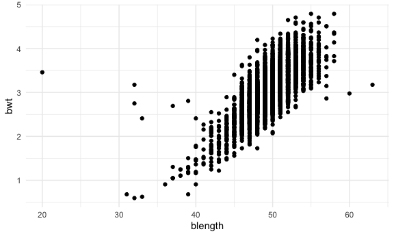
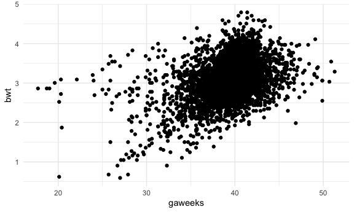

Homework 6
================
Jerry Chao, UNI: jyc 2171

### Problem 1

``` r
homicide_df =
  read_csv("./data/homicide-data.csv", na = c("", "NA", "Unknown")) %>% 
  mutate(
    city_state = str_c(city, state, sep = ", "),
    victim_age = as.numeric(victim_age),
    resolution = case_when(
      disposition == "Closed without arrest" ~ 0,
      disposition == "Open/No arrest"        ~ 0,
      disposition == "Closed by arrest"      ~ 1)
  ) %>%
  filter(
    victim_race %in% c("White", "Black"),
    city_state != "Tulsa, AL"
  )  %>% 
  select(city_state, resolution, victim_age, victim_race, victim_sex)
```

    ## Parsed with column specification:
    ## cols(
    ##   uid = col_character(),
    ##   reported_date = col_double(),
    ##   victim_last = col_character(),
    ##   victim_first = col_character(),
    ##   victim_race = col_character(),
    ##   victim_age = col_double(),
    ##   victim_sex = col_character(),
    ##   city = col_character(),
    ##   state = col_character(),
    ##   lat = col_double(),
    ##   lon = col_double(),
    ##   disposition = col_character()
    ## )

Start with one city.

``` r
baltimore_df =
  homicide_df %>% 
  filter(city_state == "Baltimore, MD")

glm(resolution ~ victim_age + victim_race + victim_sex,
    data = baltimore_df,
    family = binomial()) %>% 
  broom::tidy() %>% 
  mutate(
    OR = exp(estimate),
    CI_lower = exp(estimate - 1.96 * std.error),
    CI_upper = exp(estimate + 1.96 * std.error)
  ) %>% 
  select(term, OR, starts_with("CI")) %>% 
  knitr::kable(digits = 3)
```

| term              |    OR | CI\_lower | CI\_upper |
| :---------------- | ----: | --------: | --------: |
| (Intercept)       | 1.363 |     0.975 |     1.907 |
| victim\_age       | 0.993 |     0.987 |     1.000 |
| victim\_raceWhite | 2.320 |     1.648 |     3.268 |
| victim\_sexMale   | 0.426 |     0.325 |     0.558 |

Try this across cities - not just Baltimore, but for every city in my
dataset. The process for this is: (1) Nesting my dataset - so that I get
a dataframe for each city (2) Map over that list, fitting the regression
model that I care about for each city (3) Tidy up the results by mapping
across regression models (4) At the end of that, I am left with another
dataframe with contains city, estimates of odds ratios and intercept,
and look at these effects city-by-city

``` r
models_results_df =
  homicide_df %>% 
  nest(data = -city_state) %>% 
  mutate(
    models = map(.x = data, ~glm(resolution ~ victim_age + victim_race + victim_sex, data = .x, family = binomial())),
    results = map(models, broom::tidy)
  ) %>% 
  select(city_state, results) %>% 
  unnest(results) %>% 
  mutate(
    OR = exp(estimate),
    CI_lower = exp(estimate - 1.96 * std.error),
    CI_upper = exp(estimate + 1.96 * std.error)
  ) %>% 
  select(city_state, term, OR, starts_with("CI"))

#check to make sure the model matches baltimore_df from above as an intermediate check
#models_results_df %>% 
#  filter(city_state == "Baltimore, MD") %>% 
#  pull(models) 
```

Make a plot - similar to last homework - of ORs, comparing male to
female across cities. Across cities, are males vs. females more or less
likely to have their homoicides resolved?

``` r
models_results_df %>% 
  filter(term == "victim_sexMale") %>% 
  mutate(
    city_state = fct_reorder(city_state, OR)
  ) %>% 
  ggplot(aes(x = city_state, y = OR)) +
  geom_point() +
  geom_errorbar(aes(ymin = CI_lower, ymax = CI_upper)) +
  theme(axis.text.x = element_text(angle = 90, hjust = 1))
```


``` r
#Interpretation: male sex is associated with lower likelihood of having homicides resolved compared to females
```

# Problem 2

fit two models as specified, third model is our discretion (deliberately
open ended) then compare the three models using cross validation

Process: (1) Fit the two specified models (2) Do cross-validation on
those based on the lecture videos - get cross-validation to work on this
new dataset Then, (3) Spend some time building your model = fit some
models, look for statistical significant, look at residuals, etc. Your
model should be better than the first model, maybe better than the 3-way
interaction model

Find some residuals

``` r
baby_df =
  read_csv("./data/birthweight.csv")
```

    ## Parsed with column specification:
    ## cols(
    ##   .default = col_double()
    ## )

    ## See spec(...) for full column specifications.

fit a model

``` r
model_fit = lm(bwt ~ gaweeks, data = baby_df)
```

``` r
baby_df %>% 
  modelr::add_residuals(model_fit) %>% 
  ggplot(aes(x = resid)) +
  geom_density()
```



``` r
baby_df %>% 
  modelr::add_residuals(model_fit) %>% 
  ggplot(aes(x = gaweeks, y = resid)) +
  geom_point()
```



evaluating residuals: (1) Is there skewness in the distribution? (2) Is
there any sort of trend? Linear? Non-linear? Parabola?

# Problem 3

Central Park Weather dataset Try to use the bootstrap to obtain
distributions for parameters that you are interested in - will
eventually calculate a confidence interval Process: (1) download dataset
- make sure that that works (2) fit model to that dataset (3) make sure
to be able to calculate R^2 (use “broom::glance()”)and the specified log
computation

fit a linear model of max temp vs min temp – two things interested in
(1) R2 value - the proportion of outcome variation explained by the
predictor and (2) log(estimated intercept \* estimated slope) - get
broom tidy, get your estimated coefficients, get them next to each
other, them multiply and do log. start with one model first to get the
process for one, then how do you do it for multiple with bootstrap
samples). Then, once you’re done and by the end, you making plots and/or
group by, making confidence intervals for R^2 and log computation.
