Homework 6
================
Jerry Chao, UNI: jyc 2171

    ## ── Attaching packages ───────────────────────────────────────────────────────────────────── tidyverse 1.3.0 ──

    ## ✓ ggplot2 3.3.2     ✓ purrr   0.3.4
    ## ✓ tibble  3.0.3     ✓ dplyr   1.0.2
    ## ✓ tidyr   1.1.2     ✓ stringr 1.4.0
    ## ✓ readr   1.3.1     ✓ forcats 0.5.0

    ## ── Conflicts ──────────────────────────────────────────────────────────────────────── tidyverse_conflicts() ──
    ## x dplyr::filter() masks stats::filter()
    ## x dplyr::lag()    masks stats::lag()

    ## Loading required package: nlme

    ## 
    ## Attaching package: 'nlme'

    ## The following object is masked from 'package:dplyr':
    ## 
    ##     collapse

    ## This is mgcv 1.8-33. For overview type 'help("mgcv-package")'.

### Problem 1

``` r
homicide_df =
  read_csv("./data/homicide-data.csv", na = c("", "NA", "Unknown")) %>% 
  mutate(
    city_state = str_c(city, state, sep = ", "),
    victim_age = as.numeric(victim_age),
    resolution = case_when(
      disposition == "Closed without arrest" ~ 0,
      disposition == "Open/No arrest"        ~ 0,
      disposition == "Closed by arrest"      ~ 1)
  ) %>%
  filter(
    victim_race %in% c("White", "Black"),
    city_state != "Tulsa, AL"
  )  %>% 
  select(city_state, resolution, victim_age, victim_race, victim_sex)
```

    ## Parsed with column specification:
    ## cols(
    ##   uid = col_character(),
    ##   reported_date = col_double(),
    ##   victim_last = col_character(),
    ##   victim_first = col_character(),
    ##   victim_race = col_character(),
    ##   victim_age = col_double(),
    ##   victim_sex = col_character(),
    ##   city = col_character(),
    ##   state = col_character(),
    ##   lat = col_double(),
    ##   lon = col_double(),
    ##   disposition = col_character()
    ## )

Start with one city.

``` r
baltimore_df =
  homicide_df %>% 
  filter(city_state == "Baltimore, MD")

glm(resolution ~ victim_age + victim_race + victim_sex,
    data = baltimore_df,
    family = binomial()) %>% 
  broom::tidy() %>% 
  mutate(
    OR = exp(estimate),
    CI_lower = exp(estimate - 1.96 * std.error),
    CI_upper = exp(estimate + 1.96 * std.error)
  ) %>% 
  select(term, OR, starts_with("CI")) %>% 
  knitr::kable(digits = 3)
```

| term              |    OR | CI\_lower | CI\_upper |
| :---------------- | ----: | --------: | --------: |
| (Intercept)       | 1.363 |     0.975 |     1.907 |
| victim\_age       | 0.993 |     0.987 |     1.000 |
| victim\_raceWhite | 2.320 |     1.648 |     3.268 |
| victim\_sexMale   | 0.426 |     0.325 |     0.558 |

Try this across cities - not just Baltimore, but for every city in my
dataset. The process for this is: (1) Nesting my dataset - so that I get
a dataframe for each city (2) Map over that list, fitting the regression
model that I care about for each city (3) Tidy up the results by mapping
across regression models (4) At the end of that, I am left with another
dataframe with contains city, estimates of odds ratios and intercept,
and look at these effects city-by-city

``` r
models_results_df =
  homicide_df %>% 
  nest(data = -city_state) %>% 
  mutate(
    models = map(.x = data, ~glm(resolution ~ victim_age + victim_race + victim_sex, data = .x, family = binomial())),
    results = map(models, broom::tidy)
  ) %>% 
  select(city_state, results) %>% 
  unnest(results) %>% 
  mutate(
    OR = exp(estimate),
    CI_lower = exp(estimate - 1.96 * std.error),
    CI_upper = exp(estimate + 1.96 * std.error)
  ) %>% 
  select(city_state, term, OR, starts_with("CI"))

#check to make sure the model matches baltimore_df from above as an intermediate check
#models_results_df %>% 
#  filter(city_state == "Baltimore, MD") %>% 
#  pull(models) 
```

Make a plot - similar to last homework - of ORs, comparing male to
female across cities. Across cities, are males vs. females more or less
likely to have their homoicides resolved?

``` r
models_results_df %>% 
  filter(term == "victim_sexMale") %>% 
  mutate(
    city_state = fct_reorder(city_state, OR)
  ) %>% 
  ggplot(aes(x = city_state, y = OR)) +
  geom_point() +
  geom_errorbar(aes(ymin = CI_lower, ymax = CI_upper)) +
  theme(axis.text.x = element_text(angle = 90, hjust = 1))
```


``` r
#Interpretation: male sex is associated with lower likelihood of having homicides resolved compared to females
```

# Problem 2

This is my solution for Problem 2

My solution to Problem 2 is structured in 4 parts: (1) Import, clean,
and tidying the data. (2) Explore the data and fit my model, explaining
my rationale and model-building process, followed by diagnostics using
add\_residuals and add\_predictions. (3) Perform cross-validation of the
2 specified models in the homework stem, as a start, in order to make
sure I can do it. (4) Perform cross-validation including all 3 models.

First, I have assigned an id number to each observation. Next, I have
assigned the corresponding variable names to their numerical coding. I
have converted some units so that they make more sense to me: birth
weight from grams to kilograms, all weights in pounds to kilograms, and
family monthly income from hundreds to single units (e.g., 35 to 3500).
I have deselected “pnumlbw” and “pnumsga”, since all observations for
these variables are zero. I have converted “babysex” to a factor
variable, since it may be interesting to look at variables by biological
sex, and I have releveled such that female is the reference category. I
have also releveled mrace with white as the reference level. There does
not appear to be much missing data.

``` r
baby_df =
  read_csv("./data/birthweight.csv") %>% 
  mutate(
    id = sample(1:4342, 4342),
    babysex = recode(babysex, "2" = "female", "1" = "male"),
    babysex = fct_relevel(babysex, "female", "male"),
    bwt = bwt / 1000,
    momwt = delwt / 2.2046226218,
    fincome = fincome * 100,
    frace = 
      recode(frace, "1" = "white", "2" = "black", "3" = "asian", "4" = "puerto rican", "8" = "other", "9" = "unknown"),
    frace = fct_relevel(frace, "white", "black", "puerto rican", "asian", "other"),
    malform = recode(malform, "0" = "absent", "1" = "present"),
    mheight = mheight * 2.54,
    mrace = recode(mrace, "1" = "white", "2" = "black", "3" = "asian", "4" = "puerto rican", "8" = "other"),
    mrace = fct_relevel(mrace, "white", "black", "puerto rican", "asian"),
    ppwt = ppwt / 2.2046226218,
    wtgain = wtgain / 2.2046226218
  ) %>% 
  select(id, babysex, bhead, blength, bwt, momwt, everything(), -delwt, -pnumlbw, -pnumsga) %>% 
  arrange(id)
```

    ## Parsed with column specification:
    ## cols(
    ##   .default = col_double()
    ## )

    ## See spec(...) for full column specifications.

Some univariate exploratory plots to check my data cleaning AND explore
some general associations.

``` r
baby_df %>% 
  ggplot(aes(x = babysex, y = bwt)) +
  geom_boxplot()

baby_df %>% 
  ggplot(aes(x = bwt, group = babysex, fill = babysex)) +
  geom_density(alpha = .5)

baby_df %>% 
  mutate(
    mrace = as.factor(mrace),
    mrace = fct_reorder(mrace, bwt)
  ) %>% 
  ggplot(aes(x = mrace, y = bwt)) +
  geom_boxplot()
#maternal race seems associated

baby_df %>% 
  mutate(
    frace = as.factor(frace),
    frace = fct_reorder(frace, bwt)
  ) %>% 
  ggplot(aes(x = frace, y = bwt)) +
  geom_boxplot()

baby_df %>% 
  ggplot(aes(x = momwt, y = bwt)) +
  geom_point() +
  geom_smooth()

baby_df %>% 
  ggplot(aes(x = ppwt, y = bwt)) +
  geom_point() +
  geom_smooth()

baby_df %>% 
  ggplot(aes(x = bhead, y = bwt)) +
  geom_point() +
  geom_smooth()
  
baby_df %>% 
  mutate(
    bhead = as.factor(bhead),
    bhead = fct_reorder(bhead, bwt)
  ) %>% 
  ggplot(aes(x = bhead, y = bwt)) +
  geom_boxplot()
#bhead seems strongly associated with bwt

baby_df %>% 
  ggplot(aes(x = blength, y = bwt)) +
  geom_point() +
  geom_smooth()

baby_df %>% 
  mutate(
    blength = as.factor(blength),
    blength = fct_reorder(blength, bwt)
  ) %>% 
  ggplot(aes(x = blength, y = bwt)) +
  geom_boxplot() +
  theme(axis.text.x = element_text(angle = 90, hjust = 1))

baby_df %>% 
  ggplot(aes(x = gaweeks, y = bwt)) +
  geom_point() +
  geom_smooth()

baby_df %>% 
  mutate(
    gaweeks = as.factor(gaweeks),
    gaweeks = fct_reorder(gaweeks, bwt)
  ) %>% 
  ggplot(aes(x = gaweeks, y = bwt)) +
  geom_boxplot() +
  theme(axis.text.x = element_text(angle = 90, hjust = 1))
#gaweeks seem associated

baby_df %>% 
  ggplot(aes(x = fincome, y = bwt)) +
  geom_point() +
  geom_smooth()

baby_df %>% 
  mutate(
    fincome = as.factor(fincome),
    fincome = fct_reorder(fincome, bwt)
  ) %>% 
  ggplot(aes(x = fincome, y = bwt)) +
  geom_boxplot()

baby_df %>% 
  ggplot(aes(x = malform, y = bwt)) +
  geom_boxplot()

baby_df %>% 
  ggplot(aes(x = menarche, y = bwt)) +
  geom_point() +
  geom_smooth()

baby_df %>% 
  mutate(
    menarche = as.factor(menarche),
    menarche = fct_reorder(menarche, bwt)
  ) %>% 
  ggplot(aes(x = menarche, y = bwt)) +
  geom_boxplot()

baby_df %>% 
  mutate(
    parity = as.factor(parity),
    parity = fct_reorder(parity, bwt)
  ) %>% 
  ggplot(aes(x = parity, y = bwt)) +
  geom_boxplot()

baby_df %>% 
  ggplot(aes(x = ppbmi, y = bwt)) +
  geom_point() +
  geom_smooth()

baby_df %>% 
  ggplot(aes(x = smoken, y = bwt)) +
  geom_point() +
  geom_smooth()

baby_df %>% 
  mutate(
    smoken = as.factor(smoken),
    smoken = fct_reorder(smoken, bwt)
  ) %>% 
  ggplot(aes(x = smoken, y = bwt)) +
  geom_boxplot() +
  theme(axis.text.x = element_text(angle = 90, hjust = 1))

baby_df %>% 
  ggplot(aes(x = wtgain, y = bwt)) +
  geom_point() +
  geom_smooth()
```

Next, I will fit univariate linear models to assess the p values of
variables for consideration for inclusion into my model, at a level of
statistical significance of p \< 0.05. A priori based on my exploratory
ggplots and biological theory, I will definitely select babysex, mrace,
momwt, bhead, blength, gaweeks.

``` r
#First, univariate regression of my a priori selected variables
lm(bwt ~ babysex, data = baby_df) %>% broom::tidy()
```

    ## # A tibble: 2 x 5
    ##   term        estimate std.error statistic      p.value
    ##   <chr>          <dbl>     <dbl>     <dbl>        <dbl>
    ## 1 (Intercept)   3.07      0.0111    276.   0           
    ## 2 babysexmale   0.0888    0.0155      5.73 0.0000000108

``` r
#p = 0.0000000108
lm(bwt ~ mrace, data = baby_df) %>% broom::tidy()
```

    ## # A tibble: 4 x 5
    ##   term              estimate std.error statistic  p.value
    ##   <chr>                <dbl>     <dbl>     <dbl>    <dbl>
    ## 1 (Intercept)          3.27     0.0105    310.   0.      
    ## 2 mraceblack          -0.317    0.0154    -20.6  6.25e-90
    ## 3 mracepuerto rican   -0.211    0.0331     -6.39 1.86e-10
    ## 4 mraceasian          -0.126    0.0753     -1.68 9.32e- 2

``` r
#with white as reference, black maternal race (p = 6.25e-90) and puerto rican maternal race (-6.39 1.86e-10) are statistically significant
lm(bwt ~ momwt, data = baby_df) %>% broom::tidy()
```

    ## # A tibble: 2 x 5
    ##   term        estimate std.error statistic  p.value
    ##   <chr>          <dbl>     <dbl>     <dbl>    <dbl>
    ## 1 (Intercept)   2.15    0.0494        43.5 0.      
    ## 2 momwt         0.0146  0.000739      19.8 1.22e-83

``` r
#p = 1.22e-83
lm(bwt ~ bhead, data = baby_df) %>% broom::tidy()
```

    ## # A tibble: 2 x 5
    ##   term        estimate std.error statistic p.value
    ##   <chr>          <dbl>     <dbl>     <dbl>   <dbl>
    ## 1 (Intercept)   -4.83    0.107       -45.0       0
    ## 2 bhead          0.236   0.00319      74.0       0

``` r
#p = 0, collinear variables?
lm(bwt ~ blength, data = baby_df) %>% broom::tidy()
```

    ## # A tibble: 2 x 5
    ##   term        estimate std.error statistic   p.value
    ##   <chr>          <dbl>     <dbl>     <dbl>     <dbl>
    ## 1 (Intercept)   -3.84    0.0951      -40.4 5.44e-303
    ## 2 blength        0.140   0.00191      73.2 0.

``` r
#p = 0, collinear?
lm(bwt ~ gaweeks, data = baby_df) %>% broom::tidy()
```

    ## # A tibble: 2 x 5
    ##   term        estimate std.error statistic   p.value
    ##   <chr>          <dbl>     <dbl>     <dbl>     <dbl>
    ## 1 (Intercept)   0.476    0.0888       5.36 8.76e-  8
    ## 2 gaweeks       0.0669   0.00225     29.8  9.69e-178

``` r
#p = 9.69e-178

#next, the other variables
lm(bwt ~ fincome, data = baby_df) %>% broom::tidy()
```

    ## # A tibble: 2 x 5
    ##   term         estimate  std.error statistic  p.value
    ##   <chr>           <dbl>      <dbl>     <dbl>    <dbl>
    ## 1 (Intercept) 2.98      0.0151         197.  0.      
    ## 2 fincome     0.0000305 0.00000296      10.3 1.26e-24

``` r
#p = 1.26e-24
lm(bwt ~ frace, data = baby_df) %>% broom::tidy()
```

    ## # A tibble: 5 x 5
    ##   term              estimate std.error statistic  p.value
    ##   <chr>                <dbl>     <dbl>     <dbl>    <dbl>
    ## 1 (Intercept)         3.27      0.0106   307.    0.      
    ## 2 fraceblack         -0.314     0.0154   -20.3   7.79e-88
    ## 3 fracepuerto rican  -0.204     0.0328    -6.21  5.85e-10
    ## 4 fraceasian         -0.106     0.0729    -1.45  1.47e- 1
    ## 5 fraceother         -0.0885    0.131     -0.675 5.00e- 1

``` r
#with white as reference, black paternal race and puerto rican race are statistically significant (6.25e-90 and 1.86e-10 respectively)
lm(bwt ~ malform, data = baby_df) %>% broom::tidy()
```

    ## # A tibble: 2 x 5
    ##   term           estimate std.error statistic p.value
    ##   <chr>             <dbl>     <dbl>     <dbl>   <dbl>
    ## 1 (Intercept)      3.11     0.00779  400.       0    
    ## 2 malformpresent   0.0116   0.132      0.0878   0.930

``` r
#p = 0.930
lm(bwt ~ menarche, data = baby_df) %>% broom::tidy()
```

    ## # A tibble: 2 x 5
    ##   term        estimate std.error statistic p.value
    ##   <chr>          <dbl>     <dbl>     <dbl>   <dbl>
    ## 1 (Intercept)  3.22      0.0663      48.6    0    
    ## 2 menarche    -0.00847   0.00526     -1.61   0.108

``` r
#p = 0.108
lm(bwt ~ parity, data = baby_df) %>% broom::tidy()
```

    ## # A tibble: 2 x 5
    ##   term        estimate std.error statistic p.value
    ##   <chr>          <dbl>     <dbl>     <dbl>   <dbl>
    ## 1 (Intercept)   3.11     0.00777   401.      0    
    ## 2 parity       -0.0417   0.0755     -0.552   0.581

``` r
#p = 0.581
lm(bwt ~ ppbmi, data = baby_df) %>% broom::tidy()
```

    ## # A tibble: 2 x 5
    ##   term        estimate std.error statistic  p.value
    ##   <chr>          <dbl>     <dbl>     <dbl>    <dbl>
    ## 1 (Intercept)   2.79     0.0530      52.6  0.      
    ## 2 ppbmi         0.0151   0.00243      6.22 5.56e-10

``` r
#p = 5.56e-10
lm(bwt ~ ppwt, data = baby_df) %>% broom::tidy()
```

    ## # A tibble: 2 x 5
    ##   term        estimate std.error statistic  p.value
    ##   <chr>          <dbl>     <dbl>     <dbl>    <dbl>
    ## 1 (Intercept)   2.54    0.0474        53.6 0.      
    ## 2 ppwt          0.0102  0.000836      12.3 5.69e-34

``` r
#p = 5.69e-34
lm(bwt ~ smoken, data = baby_df) %>% broom::tidy()
```

    ## # A tibble: 2 x 5
    ##   term        estimate std.error statistic     p.value
    ##   <chr>          <dbl>     <dbl>     <dbl>       <dbl>
    ## 1 (Intercept)  3.14      0.00888    353.   0          
    ## 2 smoken      -0.00523   0.00105     -5.00 0.000000607

``` r
#p = 0.000000607
lm(bwt ~ wtgain, data = baby_df) %>% broom::tidy()
```

    ## # A tibble: 2 x 5
    ##   term        estimate std.error statistic  p.value
    ##   <chr>          <dbl>     <dbl>     <dbl>    <dbl>
    ## 1 (Intercept)   2.86     0.0170      169.  0.      
    ## 2 wtgain        0.0255   0.00152      16.8 1.73e-61

``` r
#p = 1.73e-61
```

Based on univariate analyses, the following predictors are statistically
significant at the p \< 0.05 level: babysex, mrace, momwt, gaweeks,
fincome, frace, ppbmi, ppwt, smoken, and wtgain. Bhead and blength have
p values equal to zero - I wonder if these are collinear variables
(since they all kind of measure the same thing). I will include these
anyway because, why not?

So my final model will consist of the following variables: babysex,
mrace, momwt, gaweeks, fincome, frace, ppbmi, ppwt, smoken, wtgain,
bhead and blength. I will not assess for confounding or interaction at
this time, and if I have time, I will come back and assess for these. In
particular, babysex and mrace may show important interactions for
further exploration. For now, this seems to be a “reasonable” model for
me to move forward in the homework problem to perform cross-validation.

``` r
lm_3 = lm(bwt ~ gaweeks + bhead + blength + momwt + babysex + mrace + frace + fincome + ppbmi + ppwt + smoken + wtgain, data = baby_df)

lm_3 %>% 
  broom::tidy() %>% 
  knitr::kable()
```

| term              |    estimate | std.error |    statistic |   p.value |
| :---------------- | ----------: | --------: | -----------: | --------: |
| (Intercept)       | \-5.6456321 | 0.1002307 | \-56.3263947 | 0.0000000 |
| gaweeks           |   0.0112947 | 0.0014590 |    7.7415305 | 0.0000000 |
| bhead             |   0.1309766 | 0.0034506 |   37.9574667 | 0.0000000 |
| blength           |   0.0749478 | 0.0020209 |   37.0866187 | 0.0000000 |
| momwt             |   0.0091051 | 0.0008653 |   10.5223280 | 0.0000000 |
| babysexmale       | \-0.0291352 | 0.0084601 |  \-3.4438370 | 0.0005790 |
| mraceblack        | \-0.1519054 | 0.0460318 |  \-3.3000113 | 0.0009746 |
| mracepuerto rican | \-0.0574819 | 0.0451207 |  \-1.2739588 | 0.2027465 |
| mraceasian        | \-0.0932780 | 0.0718082 |  \-1.2989883 | 0.1940172 |
| fraceblack        |   0.0128140 | 0.0461407 |    0.2777170 | 0.7812429 |
| fracepuerto rican | \-0.0494659 | 0.0446677 |  \-1.1074205 | 0.2681738 |
| fraceasian        |   0.0204434 | 0.0692812 |    0.2950786 | 0.7679480 |
| fraceother        |   0.0033408 | 0.0740839 |    0.0450943 | 0.9640342 |
| fincome           |   0.0000031 | 0.0000018 |    1.7909157 | 0.0733767 |
| ppbmi             | \-0.0091323 | 0.0025802 |  \-3.5393256 | 0.0004054 |
| ppwt              | \-0.0024358 | 0.0012526 |  \-1.9445740 | 0.0518910 |
| smoken            | \-0.0048771 | 0.0005870 |  \-8.3090624 | 0.0000000 |
| wtgain            |          NA |        NA |           NA |        NA |

Diagnostics on my model…

``` r
modelr::add_residuals(baby_df, lm_3)
```

    ## Warning in predict.lm(model, data): prediction from a rank-deficient fit may be
    ## misleading

    ## # A tibble: 4,342 x 20
    ##       id babysex bhead blength   bwt momwt fincome frace gaweeks malform
    ##    <int> <fct>   <dbl>   <dbl> <dbl> <dbl>   <dbl> <fct>   <dbl> <chr>  
    ##  1     1 male       35      52  3.26  63.5    3500 puer…    40.3 absent 
    ##  2     2 female     32      51  3.09  63.5    3500 black    41.4 absent 
    ##  3     3 female     32      47  2.89  62.6    2500 black    35.3 absent 
    ##  4     4 female     34      50  3.40  81.6    3500 black    39.4 absent 
    ##  5     5 female     34      50  3.52  59.9    4500 puer…    41.1 absent 
    ##  6     6 male       35      51  3.18  64.9    5500 puer…    37.6 absent 
    ##  7     7 male       34      51  3.66  80.7    1500 black    39.4 absent 
    ##  8     8 male       36      51  3.68  79.8    4500 black    38.1 absent 
    ##  9     9 male       35      52  3.52  73.0    4500 white    42.1 absent 
    ## 10    10 female     30      44  2.01  62.1    3500 puer…    34.1 absent 
    ## # … with 4,332 more rows, and 10 more variables: menarche <dbl>, mheight <dbl>,
    ## #   momage <dbl>, mrace <fct>, parity <dbl>, ppbmi <dbl>, ppwt <dbl>,
    ## #   smoken <dbl>, wtgain <dbl>, resid <dbl>

``` r
modelr::add_residuals(baby_df, lm_3) %>% 
  ggplot(aes(x = gaweeks, y = resid)) +
  geom_violin()
```

    ## Warning in predict.lm(model, data): prediction from a rank-deficient fit may be
    ## misleading

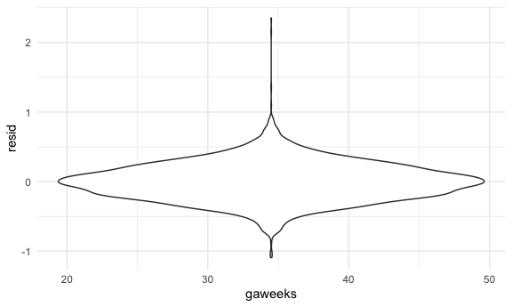

``` r
#the distribution of the residuals is mostly around 0, but there are some outliers and skewness towards +2

modelr::add_residuals(baby_df, lm_3) %>% 
  ggplot(aes(x = bhead, y = resid)) +
  geom_violin()
```

    ## Warning in predict.lm(model, data): prediction from a rank-deficient fit may be
    ## misleading

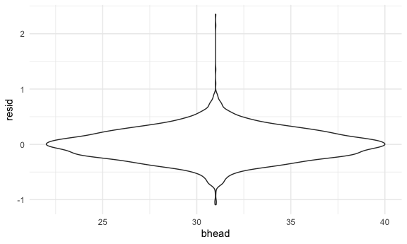

``` r
#the distribution of the residuals is mostly around 0, but there are some outliers and some skewness towards +2

modelr::add_residuals(baby_df, lm_3) %>% 
  ggplot(aes(x = blength, y = resid)) +
  geom_violin()
```

    ## Warning in predict.lm(model, data): prediction from a rank-deficient fit may be
    ## misleading

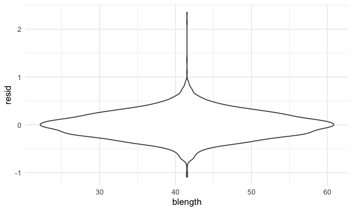

``` r
modelr::add_residuals(baby_df, lm_3) %>% 
  ggplot(aes(x = momwt, y = resid)) +
  geom_violin()
```

    ## Warning in predict.lm(model, data): prediction from a rank-deficient fit may be
    ## misleading


``` r
modelr::add_residuals(baby_df, lm_3) %>% 
  ggplot(aes(x = babysex, y = resid)) +
  geom_violin()
```

    ## Warning in predict.lm(model, data): prediction from a rank-deficient fit may be
    ## misleading

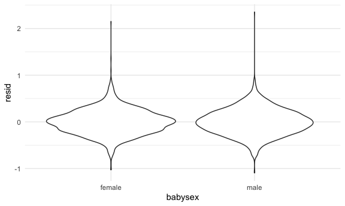

``` r
modelr::add_residuals(baby_df, lm_3) %>% 
  ggplot(aes(x = mrace, y = resid)) +
  geom_violin()
```

    ## Warning in predict.lm(model, data): prediction from a rank-deficient fit may be
    ## misleading

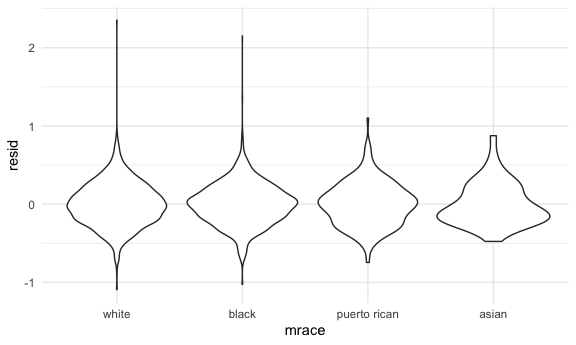

``` r
modelr::add_residuals(baby_df, lm_3) %>% 
  ggplot(aes(x = frace, y = resid)) +
  geom_violin()
```

    ## Warning in predict.lm(model, data): prediction from a rank-deficient fit may be
    ## misleading

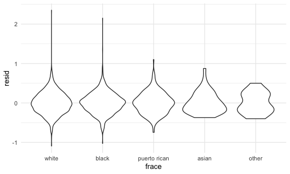

``` r
modelr::add_residuals(baby_df, lm_3) %>% 
  ggplot(aes(x = fincome, y = resid)) +
  geom_violin()
```

    ## Warning in predict.lm(model, data): prediction from a rank-deficient fit may be
    ## misleading

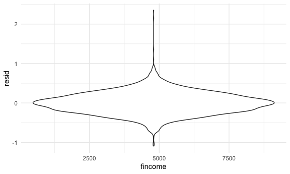

``` r
modelr::add_residuals(baby_df, lm_3) %>% 
  ggplot(aes(x = ppbmi, y = resid)) +
  geom_violin()
```

    ## Warning in predict.lm(model, data): prediction from a rank-deficient fit may be
    ## misleading


``` r
modelr::add_residuals(baby_df, lm_3) %>% 
  ggplot(aes(x = ppwt, y = resid)) +
  geom_violin()
```

    ## Warning in predict.lm(model, data): prediction from a rank-deficient fit may be
    ## misleading


``` r
modelr::add_residuals(baby_df, lm_3) %>% 
  ggplot(aes(x = smoken, y = resid)) +
  geom_violin()
```

    ## Warning in predict.lm(model, data): prediction from a rank-deficient fit may be
    ## misleading

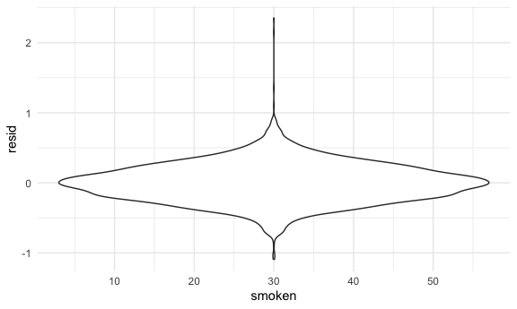

``` r
modelr::add_residuals(baby_df, lm_3) %>% 
  ggplot(aes(x = wtgain, y = resid)) +
  geom_violin()
```

    ## Warning in predict.lm(model, data): prediction from a rank-deficient fit may be
    ## misleading


``` r
#in general, these plots all show some skewness

modelr::add_residuals(baby_df, lm_3) %>% 
  ggplot(aes(x = gaweeks, y = resid)) +
  geom_point() +
  facet_wrap(. ~ mrace)
```

    ## Warning in predict.lm(model, data): prediction from a rank-deficient fit may be
    ## misleading


``` r
modelr::add_residuals(baby_df, lm_3) %>% 
  ggplot(aes(x = gaweeks, y = resid)) +
  geom_violin() +
  facet_wrap(. ~ mrace)
```

    ## Warning in predict.lm(model, data): prediction from a rank-deficient fit may be
    ## misleading

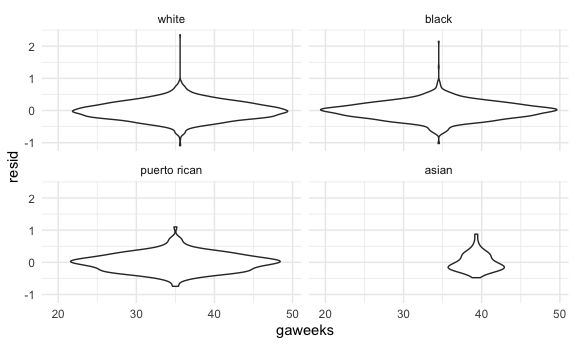

``` r
modelr::add_residuals(baby_df, lm_3) %>% 
  ggplot(aes(x = bhead, y = resid)) +
  geom_violin() +
  facet_wrap(. ~ mrace)
```

    ## Warning in predict.lm(model, data): prediction from a rank-deficient fit may be
    ## misleading

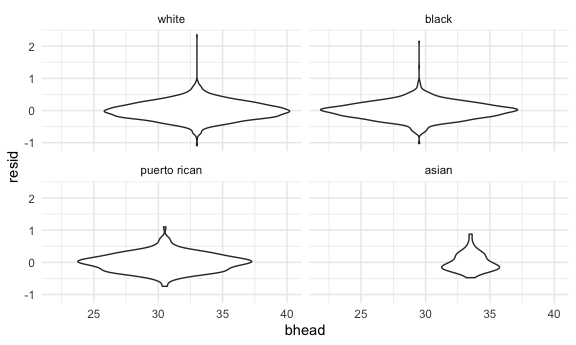

``` r
modelr::add_residuals(baby_df, lm_3) %>% 
  ggplot(aes(x = momwt, y = resid)) +
  geom_violin() +
  facet_wrap(. ~ mrace)
```

    ## Warning in predict.lm(model, data): prediction from a rank-deficient fit may be
    ## misleading

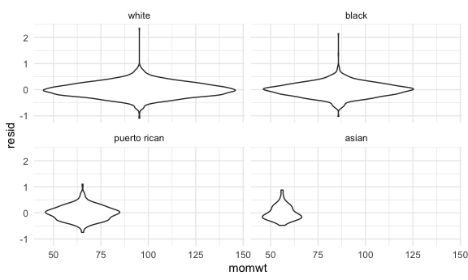

``` r
modelr::add_residuals(baby_df, lm_3) %>% 
  ggplot(aes(x = gaweeks, y = resid)) +
  geom_point() +
  facet_wrap(. ~ babysex)
```

    ## Warning in predict.lm(model, data): prediction from a rank-deficient fit may be
    ## misleading


``` r
modelr::add_residuals(baby_df, lm_3) %>% 
  ggplot(aes(x = bhead, y = resid)) +
  geom_point() +
  facet_wrap(. ~ babysex)
```

    ## Warning in predict.lm(model, data): prediction from a rank-deficient fit may be
    ## misleading

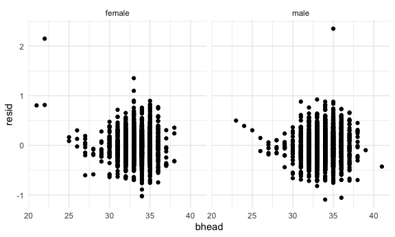

``` r
modelr::add_residuals(baby_df, lm_3) %>% 
  ggplot(aes(x = gaweeks, y = resid)) +
  geom_point() +
  facet_wrap(. ~ frace)
```

    ## Warning in predict.lm(model, data): prediction from a rank-deficient fit may be
    ## misleading

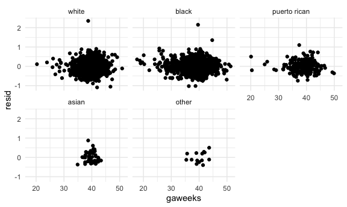

``` r
modelr::add_residuals(baby_df, lm_3) %>% 
  ggplot(aes(x = gaweeks, y = resid)) +
  geom_violin() +
  facet_wrap(. ~ frace)
```

    ## Warning in predict.lm(model, data): prediction from a rank-deficient fit may be
    ## misleading

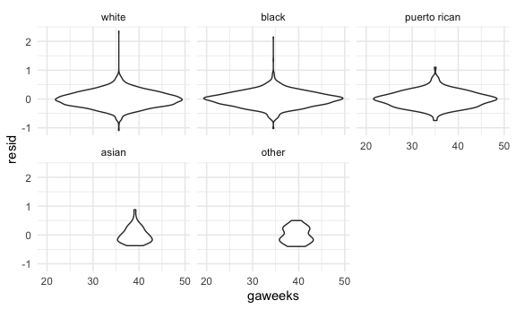

``` r
#use add_predictions

modelr::add_predictions(baby_df, lm_3)
```

    ## Warning in predict.lm(model, data): prediction from a rank-deficient fit may be
    ## misleading

    ## # A tibble: 4,342 x 20
    ##       id babysex bhead blength   bwt momwt fincome frace gaweeks malform
    ##    <int> <fct>   <dbl>   <dbl> <dbl> <dbl>   <dbl> <fct>   <dbl> <chr>  
    ##  1     1 male       35      52  3.26  63.5    3500 puer…    40.3 absent 
    ##  2     2 female     32      51  3.09  63.5    3500 black    41.4 absent 
    ##  3     3 female     32      47  2.89  62.6    2500 black    35.3 absent 
    ##  4     4 female     34      50  3.40  81.6    3500 black    39.4 absent 
    ##  5     5 female     34      50  3.52  59.9    4500 puer…    41.1 absent 
    ##  6     6 male       35      51  3.18  64.9    5500 puer…    37.6 absent 
    ##  7     7 male       34      51  3.66  80.7    1500 black    39.4 absent 
    ##  8     8 male       36      51  3.68  79.8    4500 black    38.1 absent 
    ##  9     9 male       35      52  3.52  73.0    4500 white    42.1 absent 
    ## 10    10 female     30      44  2.01  62.1    3500 puer…    34.1 absent 
    ## # … with 4,332 more rows, and 10 more variables: menarche <dbl>, mheight <dbl>,
    ## #   momage <dbl>, mrace <fct>, parity <dbl>, ppbmi <dbl>, ppwt <dbl>,
    ## #   smoken <dbl>, wtgain <dbl>, pred <dbl>

``` r
#modelr::add_predictions(baby_df, lm_3) %>% View()

#3 plots using add_predictions:

baby_df %>% 
  modelr::add_residuals(lm_3) %>% 
  ggplot(aes(x = gaweeks, y = resid)) +
  geom_violin()
```

    ## Warning in predict.lm(model, data): prediction from a rank-deficient fit may be
    ## misleading


``` r
baby_df %>% 
  modelr::add_residuals(lm_3) %>% 
  ggplot(aes(x = bhead, y = resid)) +
  geom_violin() +
  facet_wrap(. ~ babysex)
```

    ## Warning in predict.lm(model, data): prediction from a rank-deficient fit may be
    ## misleading

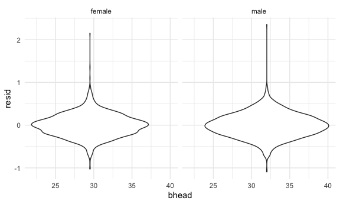

``` r
baby_df %>% 
  modelr::add_residuals(lm_3) %>% 
  ggplot(aes(x = gaweeks, y = resid)) +
  geom_violin() +
  facet_wrap(. ~ mrace)
```

    ## Warning in predict.lm(model, data): prediction from a rank-deficient fit may be
    ## misleading


``` r
#in general, some skewness in positive direction, less so in puerto rican race
```

In general, the distribution of residuals shows some skewness towards
higher values, likely reflecting outliers in the data. The pattern and
trend of the residuals seem to be clustered around a central blob and
seems overall linear. There does not appear to be a non-linear or
parabolic pattern.

Next, I will first fit the two specified models in the homework and
perform cross-validation just for these two models, to make sure I can
do it correctly.

``` r
lm_1 = lm(bwt ~ blength + gaweeks, data = baby_df) %>% broom::tidy()
lm_2 = lm(bwt ~ bhead * blength * babysex, data = baby_df) %>% broom::tidy()

cv_df = crossv_mc(baby_df, 100)

cv_df %>% pull(train) %>% .[[1]] %>% as_tibble()
```

    ## # A tibble: 3,473 x 19
    ##       id babysex bhead blength   bwt momwt fincome frace gaweeks malform
    ##    <int> <fct>   <dbl>   <dbl> <dbl> <dbl>   <dbl> <fct>   <dbl> <chr>  
    ##  1     1 male       35      52  3.26  63.5    3500 puer…    40.3 absent 
    ##  2     3 female     32      47  2.89  62.6    2500 black    35.3 absent 
    ##  3     4 female     34      50  3.40  81.6    3500 black    39.4 absent 
    ##  4     5 female     34      50  3.52  59.9    4500 puer…    41.1 absent 
    ##  5     9 male       35      52  3.52  73.0    4500 white    42.1 absent 
    ##  6    10 female     30      44  2.01  62.1    3500 puer…    34.1 absent 
    ##  7    11 female     33      49  3.00  68.5    3500 black    38.9 absent 
    ##  8    12 male       33      47  2.33  65.3    2500 white    35.3 absent 
    ##  9    14 female     34      50  3.97  61.2    9500 white    42.1 absent 
    ## 10    15 female     37      57  3.80  64.4    6500 white    41.7 absent 
    ## # … with 3,463 more rows, and 9 more variables: menarche <dbl>, mheight <dbl>,
    ## #   momage <dbl>, mrace <fct>, parity <dbl>, ppbmi <dbl>, ppwt <dbl>,
    ## #   smoken <dbl>, wtgain <dbl>

``` r
cv_df %>% pull(test) %>% .[[1]] %>% as_tibble()
```

    ## # A tibble: 869 x 19
    ##       id babysex bhead blength   bwt momwt fincome frace gaweeks malform
    ##    <int> <fct>   <dbl>   <dbl> <dbl> <dbl>   <dbl> <fct>   <dbl> <chr>  
    ##  1     2 female     32      51  3.09  63.5    3500 black    41.4 absent 
    ##  2     6 male       35      51  3.18  64.9    5500 puer…    37.6 absent 
    ##  3     7 male       34      51  3.66  80.7    1500 black    39.4 absent 
    ##  4     8 male       36      51  3.68  79.8    4500 black    38.1 absent 
    ##  5    13 male       35      51  3.40  74.4    8500 white    40   absent 
    ##  6    16 male       34      48  3.20  72.6     500 black    40.7 absent 
    ##  7    23 male       31      47  1.96  65.3    2500 black    41.6 absent 
    ##  8    25 female     34      50  3.54  68.5    6500 puer…    41.4 absent 
    ##  9    27 male       32      50  3.03  59.4    5500 white    39.7 absent 
    ## 10    28 female     34      50  3.29  98.9    2500 black    34.3 absent 
    ## # … with 859 more rows, and 9 more variables: menarche <dbl>, mheight <dbl>,
    ## #   momage <dbl>, mrace <fct>, parity <dbl>, ppbmi <dbl>, ppwt <dbl>,
    ## #   smoken <dbl>, wtgain <dbl>

``` r
cv_df =
  cv_df %>% 
  mutate(
    train = map(train, as_tibble),
    test = map(test, as_tibble)
  )

#get RMSEs for my models
cv_df =
  cv_df %>% 
  mutate(
    lm_1 = map(.x = train, ~lm(bwt ~ blength + gaweeks, data = .x)),
    lm_2 = map(.x = train, ~lm(bwt ~ bhead * blength * babysex, data = .x))
  ) %>% 
  mutate(
    rmse_lm_1 = map2_dbl(.x = lm_1, .y = test, ~rmse(model = .x, data = .y)),
    rmse_lm_2 = map2_dbl(.x = lm_2, .y = test, ~rmse(model = .x, data = .y))
  )

cv_df %>% 
  select(starts_with("rmse")) %>% 
  pivot_longer(
    everything(),
    names_to = "model",
    values_to = "rmse",
    names_prefix = "rmse_"
  ) %>% 
  ggplot(aes(x = model, y = rmse)) +
  geom_violin()
```

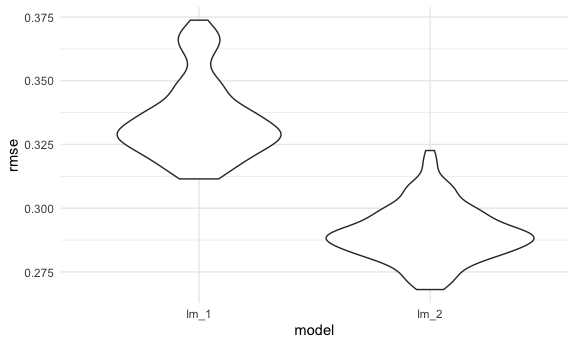

``` r
#Based on this distribution of RMSEs, lm_2 is doing better.

cv_df %>% 
  select(starts_with("rmse")) %>% 
  pivot_longer(
    everything(),
    names_to = "model",
    values_to = "rmse",
    names_prefix = "rmse_"
  ) %>% 
  group_by(model) %>% 
  summarize(avg_rmse = mean(rmse)) %>% 
  knitr::kable()
```

    ## `summarise()` ungrouping output (override with `.groups` argument)

| model | avg\_rmse |
| :---- | --------: |
| lm\_1 | 0.3348261 |
| lm\_2 | 0.2901502 |

Now, I perform cross-validation for all 3 models, including the model
that I fit.

``` r
#get RMSEs for all 3 models
cv_df =
  cv_df %>% 
  mutate(
    lm_1 = map(.x = train, ~lm(bwt ~ blength + gaweeks, data = .x)),
    lm_2 = map(.x = train, ~lm(bwt ~ bhead * blength * babysex, data = .x)),
    lm_3 = map(.x = train, ~lm(bwt ~ gaweeks + bhead + blength + momwt + babysex + mrace + frace + fincome + ppbmi + ppwt + smoken + wtgain, data = .x))
  ) %>% 
  mutate(
    rmse_lm_1 = map2_dbl(.x = lm_1, .y = test, ~rmse(model = .x, data = .y)),
    rmse_lm_2 = map2_dbl(.x = lm_2, .y = test, ~rmse(model = .x, data = .y)),
    rmse_lm_3 = map2_dbl(.x = lm_3, .y = test, ~rmse(model = .x, data = .y))
  )
```

    ## Warning: Problem with `mutate()` input `rmse_lm_3`.
    ## ℹ prediction from a rank-deficient fit may be misleading
    ## ℹ Input `rmse_lm_3` is `map2_dbl(.x = lm_3, .y = test, ~rmse(model = .x, data = .y))`.

    ## Warning in predict.lm(model, data): prediction from a rank-deficient fit may be
    ## misleading

    ## Warning: Problem with `mutate()` input `rmse_lm_3`.
    ## ℹ prediction from a rank-deficient fit may be misleading
    ## ℹ Input `rmse_lm_3` is `map2_dbl(.x = lm_3, .y = test, ~rmse(model = .x, data = .y))`.

    ## Warning in predict.lm(model, data): prediction from a rank-deficient fit may be
    ## misleading

    ## Warning: Problem with `mutate()` input `rmse_lm_3`.
    ## ℹ prediction from a rank-deficient fit may be misleading
    ## ℹ Input `rmse_lm_3` is `map2_dbl(.x = lm_3, .y = test, ~rmse(model = .x, data = .y))`.

    ## Warning in predict.lm(model, data): prediction from a rank-deficient fit may be
    ## misleading

    ## Warning: Problem with `mutate()` input `rmse_lm_3`.
    ## ℹ prediction from a rank-deficient fit may be misleading
    ## ℹ Input `rmse_lm_3` is `map2_dbl(.x = lm_3, .y = test, ~rmse(model = .x, data = .y))`.

    ## Warning in predict.lm(model, data): prediction from a rank-deficient fit may be
    ## misleading

    ## Warning: Problem with `mutate()` input `rmse_lm_3`.
    ## ℹ prediction from a rank-deficient fit may be misleading
    ## ℹ Input `rmse_lm_3` is `map2_dbl(.x = lm_3, .y = test, ~rmse(model = .x, data = .y))`.

    ## Warning in predict.lm(model, data): prediction from a rank-deficient fit may be
    ## misleading

    ## Warning: Problem with `mutate()` input `rmse_lm_3`.
    ## ℹ prediction from a rank-deficient fit may be misleading
    ## ℹ Input `rmse_lm_3` is `map2_dbl(.x = lm_3, .y = test, ~rmse(model = .x, data = .y))`.

    ## Warning in predict.lm(model, data): prediction from a rank-deficient fit may be
    ## misleading

    ## Warning: Problem with `mutate()` input `rmse_lm_3`.
    ## ℹ prediction from a rank-deficient fit may be misleading
    ## ℹ Input `rmse_lm_3` is `map2_dbl(.x = lm_3, .y = test, ~rmse(model = .x, data = .y))`.

    ## Warning in predict.lm(model, data): prediction from a rank-deficient fit may be
    ## misleading

    ## Warning: Problem with `mutate()` input `rmse_lm_3`.
    ## ℹ prediction from a rank-deficient fit may be misleading
    ## ℹ Input `rmse_lm_3` is `map2_dbl(.x = lm_3, .y = test, ~rmse(model = .x, data = .y))`.

    ## Warning in predict.lm(model, data): prediction from a rank-deficient fit may be
    ## misleading

    ## Warning: Problem with `mutate()` input `rmse_lm_3`.
    ## ℹ prediction from a rank-deficient fit may be misleading
    ## ℹ Input `rmse_lm_3` is `map2_dbl(.x = lm_3, .y = test, ~rmse(model = .x, data = .y))`.

    ## Warning in predict.lm(model, data): prediction from a rank-deficient fit may be
    ## misleading

    ## Warning: Problem with `mutate()` input `rmse_lm_3`.
    ## ℹ prediction from a rank-deficient fit may be misleading
    ## ℹ Input `rmse_lm_3` is `map2_dbl(.x = lm_3, .y = test, ~rmse(model = .x, data = .y))`.

    ## Warning in predict.lm(model, data): prediction from a rank-deficient fit may be
    ## misleading

    ## Warning: Problem with `mutate()` input `rmse_lm_3`.
    ## ℹ prediction from a rank-deficient fit may be misleading
    ## ℹ Input `rmse_lm_3` is `map2_dbl(.x = lm_3, .y = test, ~rmse(model = .x, data = .y))`.

    ## Warning in predict.lm(model, data): prediction from a rank-deficient fit may be
    ## misleading

    ## Warning: Problem with `mutate()` input `rmse_lm_3`.
    ## ℹ prediction from a rank-deficient fit may be misleading
    ## ℹ Input `rmse_lm_3` is `map2_dbl(.x = lm_3, .y = test, ~rmse(model = .x, data = .y))`.

    ## Warning in predict.lm(model, data): prediction from a rank-deficient fit may be
    ## misleading

    ## Warning: Problem with `mutate()` input `rmse_lm_3`.
    ## ℹ prediction from a rank-deficient fit may be misleading
    ## ℹ Input `rmse_lm_3` is `map2_dbl(.x = lm_3, .y = test, ~rmse(model = .x, data = .y))`.

    ## Warning in predict.lm(model, data): prediction from a rank-deficient fit may be
    ## misleading

    ## Warning: Problem with `mutate()` input `rmse_lm_3`.
    ## ℹ prediction from a rank-deficient fit may be misleading
    ## ℹ Input `rmse_lm_3` is `map2_dbl(.x = lm_3, .y = test, ~rmse(model = .x, data = .y))`.

    ## Warning in predict.lm(model, data): prediction from a rank-deficient fit may be
    ## misleading

    ## Warning: Problem with `mutate()` input `rmse_lm_3`.
    ## ℹ prediction from a rank-deficient fit may be misleading
    ## ℹ Input `rmse_lm_3` is `map2_dbl(.x = lm_3, .y = test, ~rmse(model = .x, data = .y))`.

    ## Warning in predict.lm(model, data): prediction from a rank-deficient fit may be
    ## misleading

    ## Warning: Problem with `mutate()` input `rmse_lm_3`.
    ## ℹ prediction from a rank-deficient fit may be misleading
    ## ℹ Input `rmse_lm_3` is `map2_dbl(.x = lm_3, .y = test, ~rmse(model = .x, data = .y))`.

    ## Warning in predict.lm(model, data): prediction from a rank-deficient fit may be
    ## misleading

    ## Warning: Problem with `mutate()` input `rmse_lm_3`.
    ## ℹ prediction from a rank-deficient fit may be misleading
    ## ℹ Input `rmse_lm_3` is `map2_dbl(.x = lm_3, .y = test, ~rmse(model = .x, data = .y))`.

    ## Warning in predict.lm(model, data): prediction from a rank-deficient fit may be
    ## misleading

    ## Warning: Problem with `mutate()` input `rmse_lm_3`.
    ## ℹ prediction from a rank-deficient fit may be misleading
    ## ℹ Input `rmse_lm_3` is `map2_dbl(.x = lm_3, .y = test, ~rmse(model = .x, data = .y))`.

    ## Warning in predict.lm(model, data): prediction from a rank-deficient fit may be
    ## misleading

    ## Warning: Problem with `mutate()` input `rmse_lm_3`.
    ## ℹ prediction from a rank-deficient fit may be misleading
    ## ℹ Input `rmse_lm_3` is `map2_dbl(.x = lm_3, .y = test, ~rmse(model = .x, data = .y))`.

    ## Warning in predict.lm(model, data): prediction from a rank-deficient fit may be
    ## misleading

    ## Warning: Problem with `mutate()` input `rmse_lm_3`.
    ## ℹ prediction from a rank-deficient fit may be misleading
    ## ℹ Input `rmse_lm_3` is `map2_dbl(.x = lm_3, .y = test, ~rmse(model = .x, data = .y))`.

    ## Warning in predict.lm(model, data): prediction from a rank-deficient fit may be
    ## misleading

    ## Warning: Problem with `mutate()` input `rmse_lm_3`.
    ## ℹ prediction from a rank-deficient fit may be misleading
    ## ℹ Input `rmse_lm_3` is `map2_dbl(.x = lm_3, .y = test, ~rmse(model = .x, data = .y))`.

    ## Warning in predict.lm(model, data): prediction from a rank-deficient fit may be
    ## misleading

    ## Warning: Problem with `mutate()` input `rmse_lm_3`.
    ## ℹ prediction from a rank-deficient fit may be misleading
    ## ℹ Input `rmse_lm_3` is `map2_dbl(.x = lm_3, .y = test, ~rmse(model = .x, data = .y))`.

    ## Warning in predict.lm(model, data): prediction from a rank-deficient fit may be
    ## misleading

    ## Warning: Problem with `mutate()` input `rmse_lm_3`.
    ## ℹ prediction from a rank-deficient fit may be misleading
    ## ℹ Input `rmse_lm_3` is `map2_dbl(.x = lm_3, .y = test, ~rmse(model = .x, data = .y))`.

    ## Warning in predict.lm(model, data): prediction from a rank-deficient fit may be
    ## misleading

    ## Warning: Problem with `mutate()` input `rmse_lm_3`.
    ## ℹ prediction from a rank-deficient fit may be misleading
    ## ℹ Input `rmse_lm_3` is `map2_dbl(.x = lm_3, .y = test, ~rmse(model = .x, data = .y))`.

    ## Warning in predict.lm(model, data): prediction from a rank-deficient fit may be
    ## misleading

    ## Warning: Problem with `mutate()` input `rmse_lm_3`.
    ## ℹ prediction from a rank-deficient fit may be misleading
    ## ℹ Input `rmse_lm_3` is `map2_dbl(.x = lm_3, .y = test, ~rmse(model = .x, data = .y))`.

    ## Warning in predict.lm(model, data): prediction from a rank-deficient fit may be
    ## misleading

    ## Warning: Problem with `mutate()` input `rmse_lm_3`.
    ## ℹ prediction from a rank-deficient fit may be misleading
    ## ℹ Input `rmse_lm_3` is `map2_dbl(.x = lm_3, .y = test, ~rmse(model = .x, data = .y))`.

    ## Warning in predict.lm(model, data): prediction from a rank-deficient fit may be
    ## misleading

    ## Warning: Problem with `mutate()` input `rmse_lm_3`.
    ## ℹ prediction from a rank-deficient fit may be misleading
    ## ℹ Input `rmse_lm_3` is `map2_dbl(.x = lm_3, .y = test, ~rmse(model = .x, data = .y))`.

    ## Warning in predict.lm(model, data): prediction from a rank-deficient fit may be
    ## misleading

    ## Warning: Problem with `mutate()` input `rmse_lm_3`.
    ## ℹ prediction from a rank-deficient fit may be misleading
    ## ℹ Input `rmse_lm_3` is `map2_dbl(.x = lm_3, .y = test, ~rmse(model = .x, data = .y))`.

    ## Warning in predict.lm(model, data): prediction from a rank-deficient fit may be
    ## misleading

    ## Warning: Problem with `mutate()` input `rmse_lm_3`.
    ## ℹ prediction from a rank-deficient fit may be misleading
    ## ℹ Input `rmse_lm_3` is `map2_dbl(.x = lm_3, .y = test, ~rmse(model = .x, data = .y))`.

    ## Warning in predict.lm(model, data): prediction from a rank-deficient fit may be
    ## misleading

    ## Warning: Problem with `mutate()` input `rmse_lm_3`.
    ## ℹ prediction from a rank-deficient fit may be misleading
    ## ℹ Input `rmse_lm_3` is `map2_dbl(.x = lm_3, .y = test, ~rmse(model = .x, data = .y))`.

    ## Warning in predict.lm(model, data): prediction from a rank-deficient fit may be
    ## misleading

    ## Warning: Problem with `mutate()` input `rmse_lm_3`.
    ## ℹ prediction from a rank-deficient fit may be misleading
    ## ℹ Input `rmse_lm_3` is `map2_dbl(.x = lm_3, .y = test, ~rmse(model = .x, data = .y))`.

    ## Warning in predict.lm(model, data): prediction from a rank-deficient fit may be
    ## misleading

    ## Warning: Problem with `mutate()` input `rmse_lm_3`.
    ## ℹ prediction from a rank-deficient fit may be misleading
    ## ℹ Input `rmse_lm_3` is `map2_dbl(.x = lm_3, .y = test, ~rmse(model = .x, data = .y))`.

    ## Warning in predict.lm(model, data): prediction from a rank-deficient fit may be
    ## misleading

    ## Warning: Problem with `mutate()` input `rmse_lm_3`.
    ## ℹ prediction from a rank-deficient fit may be misleading
    ## ℹ Input `rmse_lm_3` is `map2_dbl(.x = lm_3, .y = test, ~rmse(model = .x, data = .y))`.

    ## Warning in predict.lm(model, data): prediction from a rank-deficient fit may be
    ## misleading

    ## Warning: Problem with `mutate()` input `rmse_lm_3`.
    ## ℹ prediction from a rank-deficient fit may be misleading
    ## ℹ Input `rmse_lm_3` is `map2_dbl(.x = lm_3, .y = test, ~rmse(model = .x, data = .y))`.

    ## Warning in predict.lm(model, data): prediction from a rank-deficient fit may be
    ## misleading

    ## Warning: Problem with `mutate()` input `rmse_lm_3`.
    ## ℹ prediction from a rank-deficient fit may be misleading
    ## ℹ Input `rmse_lm_3` is `map2_dbl(.x = lm_3, .y = test, ~rmse(model = .x, data = .y))`.

    ## Warning in predict.lm(model, data): prediction from a rank-deficient fit may be
    ## misleading

    ## Warning: Problem with `mutate()` input `rmse_lm_3`.
    ## ℹ prediction from a rank-deficient fit may be misleading
    ## ℹ Input `rmse_lm_3` is `map2_dbl(.x = lm_3, .y = test, ~rmse(model = .x, data = .y))`.

    ## Warning in predict.lm(model, data): prediction from a rank-deficient fit may be
    ## misleading

    ## Warning: Problem with `mutate()` input `rmse_lm_3`.
    ## ℹ prediction from a rank-deficient fit may be misleading
    ## ℹ Input `rmse_lm_3` is `map2_dbl(.x = lm_3, .y = test, ~rmse(model = .x, data = .y))`.

    ## Warning in predict.lm(model, data): prediction from a rank-deficient fit may be
    ## misleading

    ## Warning: Problem with `mutate()` input `rmse_lm_3`.
    ## ℹ prediction from a rank-deficient fit may be misleading
    ## ℹ Input `rmse_lm_3` is `map2_dbl(.x = lm_3, .y = test, ~rmse(model = .x, data = .y))`.

    ## Warning in predict.lm(model, data): prediction from a rank-deficient fit may be
    ## misleading

    ## Warning: Problem with `mutate()` input `rmse_lm_3`.
    ## ℹ prediction from a rank-deficient fit may be misleading
    ## ℹ Input `rmse_lm_3` is `map2_dbl(.x = lm_3, .y = test, ~rmse(model = .x, data = .y))`.

    ## Warning in predict.lm(model, data): prediction from a rank-deficient fit may be
    ## misleading

    ## Warning: Problem with `mutate()` input `rmse_lm_3`.
    ## ℹ prediction from a rank-deficient fit may be misleading
    ## ℹ Input `rmse_lm_3` is `map2_dbl(.x = lm_3, .y = test, ~rmse(model = .x, data = .y))`.

    ## Warning in predict.lm(model, data): prediction from a rank-deficient fit may be
    ## misleading

    ## Warning: Problem with `mutate()` input `rmse_lm_3`.
    ## ℹ prediction from a rank-deficient fit may be misleading
    ## ℹ Input `rmse_lm_3` is `map2_dbl(.x = lm_3, .y = test, ~rmse(model = .x, data = .y))`.

    ## Warning in predict.lm(model, data): prediction from a rank-deficient fit may be
    ## misleading

    ## Warning: Problem with `mutate()` input `rmse_lm_3`.
    ## ℹ prediction from a rank-deficient fit may be misleading
    ## ℹ Input `rmse_lm_3` is `map2_dbl(.x = lm_3, .y = test, ~rmse(model = .x, data = .y))`.

    ## Warning in predict.lm(model, data): prediction from a rank-deficient fit may be
    ## misleading

    ## Warning: Problem with `mutate()` input `rmse_lm_3`.
    ## ℹ prediction from a rank-deficient fit may be misleading
    ## ℹ Input `rmse_lm_3` is `map2_dbl(.x = lm_3, .y = test, ~rmse(model = .x, data = .y))`.

    ## Warning in predict.lm(model, data): prediction from a rank-deficient fit may be
    ## misleading

    ## Warning: Problem with `mutate()` input `rmse_lm_3`.
    ## ℹ prediction from a rank-deficient fit may be misleading
    ## ℹ Input `rmse_lm_3` is `map2_dbl(.x = lm_3, .y = test, ~rmse(model = .x, data = .y))`.

    ## Warning in predict.lm(model, data): prediction from a rank-deficient fit may be
    ## misleading

    ## Warning: Problem with `mutate()` input `rmse_lm_3`.
    ## ℹ prediction from a rank-deficient fit may be misleading
    ## ℹ Input `rmse_lm_3` is `map2_dbl(.x = lm_3, .y = test, ~rmse(model = .x, data = .y))`.

    ## Warning in predict.lm(model, data): prediction from a rank-deficient fit may be
    ## misleading

    ## Warning: Problem with `mutate()` input `rmse_lm_3`.
    ## ℹ prediction from a rank-deficient fit may be misleading
    ## ℹ Input `rmse_lm_3` is `map2_dbl(.x = lm_3, .y = test, ~rmse(model = .x, data = .y))`.

    ## Warning in predict.lm(model, data): prediction from a rank-deficient fit may be
    ## misleading

    ## Warning: Problem with `mutate()` input `rmse_lm_3`.
    ## ℹ prediction from a rank-deficient fit may be misleading
    ## ℹ Input `rmse_lm_3` is `map2_dbl(.x = lm_3, .y = test, ~rmse(model = .x, data = .y))`.

    ## Warning in predict.lm(model, data): prediction from a rank-deficient fit may be
    ## misleading

    ## Warning: Problem with `mutate()` input `rmse_lm_3`.
    ## ℹ prediction from a rank-deficient fit may be misleading
    ## ℹ Input `rmse_lm_3` is `map2_dbl(.x = lm_3, .y = test, ~rmse(model = .x, data = .y))`.

    ## Warning in predict.lm(model, data): prediction from a rank-deficient fit may be
    ## misleading

    ## Warning: Problem with `mutate()` input `rmse_lm_3`.
    ## ℹ prediction from a rank-deficient fit may be misleading
    ## ℹ Input `rmse_lm_3` is `map2_dbl(.x = lm_3, .y = test, ~rmse(model = .x, data = .y))`.

    ## Warning in predict.lm(model, data): prediction from a rank-deficient fit may be
    ## misleading

    ## Warning: Problem with `mutate()` input `rmse_lm_3`.
    ## ℹ prediction from a rank-deficient fit may be misleading
    ## ℹ Input `rmse_lm_3` is `map2_dbl(.x = lm_3, .y = test, ~rmse(model = .x, data = .y))`.

    ## Warning in predict.lm(model, data): prediction from a rank-deficient fit may be
    ## misleading

    ## Warning: Problem with `mutate()` input `rmse_lm_3`.
    ## ℹ prediction from a rank-deficient fit may be misleading
    ## ℹ Input `rmse_lm_3` is `map2_dbl(.x = lm_3, .y = test, ~rmse(model = .x, data = .y))`.

    ## Warning in predict.lm(model, data): prediction from a rank-deficient fit may be
    ## misleading

    ## Warning: Problem with `mutate()` input `rmse_lm_3`.
    ## ℹ prediction from a rank-deficient fit may be misleading
    ## ℹ Input `rmse_lm_3` is `map2_dbl(.x = lm_3, .y = test, ~rmse(model = .x, data = .y))`.

    ## Warning in predict.lm(model, data): prediction from a rank-deficient fit may be
    ## misleading

    ## Warning: Problem with `mutate()` input `rmse_lm_3`.
    ## ℹ prediction from a rank-deficient fit may be misleading
    ## ℹ Input `rmse_lm_3` is `map2_dbl(.x = lm_3, .y = test, ~rmse(model = .x, data = .y))`.

    ## Warning in predict.lm(model, data): prediction from a rank-deficient fit may be
    ## misleading

    ## Warning: Problem with `mutate()` input `rmse_lm_3`.
    ## ℹ prediction from a rank-deficient fit may be misleading
    ## ℹ Input `rmse_lm_3` is `map2_dbl(.x = lm_3, .y = test, ~rmse(model = .x, data = .y))`.

    ## Warning in predict.lm(model, data): prediction from a rank-deficient fit may be
    ## misleading

    ## Warning: Problem with `mutate()` input `rmse_lm_3`.
    ## ℹ prediction from a rank-deficient fit may be misleading
    ## ℹ Input `rmse_lm_3` is `map2_dbl(.x = lm_3, .y = test, ~rmse(model = .x, data = .y))`.

    ## Warning in predict.lm(model, data): prediction from a rank-deficient fit may be
    ## misleading

    ## Warning: Problem with `mutate()` input `rmse_lm_3`.
    ## ℹ prediction from a rank-deficient fit may be misleading
    ## ℹ Input `rmse_lm_3` is `map2_dbl(.x = lm_3, .y = test, ~rmse(model = .x, data = .y))`.

    ## Warning in predict.lm(model, data): prediction from a rank-deficient fit may be
    ## misleading

    ## Warning: Problem with `mutate()` input `rmse_lm_3`.
    ## ℹ prediction from a rank-deficient fit may be misleading
    ## ℹ Input `rmse_lm_3` is `map2_dbl(.x = lm_3, .y = test, ~rmse(model = .x, data = .y))`.

    ## Warning in predict.lm(model, data): prediction from a rank-deficient fit may be
    ## misleading

    ## Warning: Problem with `mutate()` input `rmse_lm_3`.
    ## ℹ prediction from a rank-deficient fit may be misleading
    ## ℹ Input `rmse_lm_3` is `map2_dbl(.x = lm_3, .y = test, ~rmse(model = .x, data = .y))`.

    ## Warning in predict.lm(model, data): prediction from a rank-deficient fit may be
    ## misleading

    ## Warning: Problem with `mutate()` input `rmse_lm_3`.
    ## ℹ prediction from a rank-deficient fit may be misleading
    ## ℹ Input `rmse_lm_3` is `map2_dbl(.x = lm_3, .y = test, ~rmse(model = .x, data = .y))`.

    ## Warning in predict.lm(model, data): prediction from a rank-deficient fit may be
    ## misleading

    ## Warning: Problem with `mutate()` input `rmse_lm_3`.
    ## ℹ prediction from a rank-deficient fit may be misleading
    ## ℹ Input `rmse_lm_3` is `map2_dbl(.x = lm_3, .y = test, ~rmse(model = .x, data = .y))`.

    ## Warning in predict.lm(model, data): prediction from a rank-deficient fit may be
    ## misleading

    ## Warning: Problem with `mutate()` input `rmse_lm_3`.
    ## ℹ prediction from a rank-deficient fit may be misleading
    ## ℹ Input `rmse_lm_3` is `map2_dbl(.x = lm_3, .y = test, ~rmse(model = .x, data = .y))`.

    ## Warning in predict.lm(model, data): prediction from a rank-deficient fit may be
    ## misleading

    ## Warning: Problem with `mutate()` input `rmse_lm_3`.
    ## ℹ prediction from a rank-deficient fit may be misleading
    ## ℹ Input `rmse_lm_3` is `map2_dbl(.x = lm_3, .y = test, ~rmse(model = .x, data = .y))`.

    ## Warning in predict.lm(model, data): prediction from a rank-deficient fit may be
    ## misleading

    ## Warning: Problem with `mutate()` input `rmse_lm_3`.
    ## ℹ prediction from a rank-deficient fit may be misleading
    ## ℹ Input `rmse_lm_3` is `map2_dbl(.x = lm_3, .y = test, ~rmse(model = .x, data = .y))`.

    ## Warning in predict.lm(model, data): prediction from a rank-deficient fit may be
    ## misleading

    ## Warning: Problem with `mutate()` input `rmse_lm_3`.
    ## ℹ prediction from a rank-deficient fit may be misleading
    ## ℹ Input `rmse_lm_3` is `map2_dbl(.x = lm_3, .y = test, ~rmse(model = .x, data = .y))`.

    ## Warning in predict.lm(model, data): prediction from a rank-deficient fit may be
    ## misleading

    ## Warning: Problem with `mutate()` input `rmse_lm_3`.
    ## ℹ prediction from a rank-deficient fit may be misleading
    ## ℹ Input `rmse_lm_3` is `map2_dbl(.x = lm_3, .y = test, ~rmse(model = .x, data = .y))`.

    ## Warning in predict.lm(model, data): prediction from a rank-deficient fit may be
    ## misleading

    ## Warning: Problem with `mutate()` input `rmse_lm_3`.
    ## ℹ prediction from a rank-deficient fit may be misleading
    ## ℹ Input `rmse_lm_3` is `map2_dbl(.x = lm_3, .y = test, ~rmse(model = .x, data = .y))`.

    ## Warning in predict.lm(model, data): prediction from a rank-deficient fit may be
    ## misleading

    ## Warning: Problem with `mutate()` input `rmse_lm_3`.
    ## ℹ prediction from a rank-deficient fit may be misleading
    ## ℹ Input `rmse_lm_3` is `map2_dbl(.x = lm_3, .y = test, ~rmse(model = .x, data = .y))`.

    ## Warning in predict.lm(model, data): prediction from a rank-deficient fit may be
    ## misleading

    ## Warning: Problem with `mutate()` input `rmse_lm_3`.
    ## ℹ prediction from a rank-deficient fit may be misleading
    ## ℹ Input `rmse_lm_3` is `map2_dbl(.x = lm_3, .y = test, ~rmse(model = .x, data = .y))`.

    ## Warning in predict.lm(model, data): prediction from a rank-deficient fit may be
    ## misleading

    ## Warning: Problem with `mutate()` input `rmse_lm_3`.
    ## ℹ prediction from a rank-deficient fit may be misleading
    ## ℹ Input `rmse_lm_3` is `map2_dbl(.x = lm_3, .y = test, ~rmse(model = .x, data = .y))`.

    ## Warning in predict.lm(model, data): prediction from a rank-deficient fit may be
    ## misleading

    ## Warning: Problem with `mutate()` input `rmse_lm_3`.
    ## ℹ prediction from a rank-deficient fit may be misleading
    ## ℹ Input `rmse_lm_3` is `map2_dbl(.x = lm_3, .y = test, ~rmse(model = .x, data = .y))`.

    ## Warning in predict.lm(model, data): prediction from a rank-deficient fit may be
    ## misleading

    ## Warning: Problem with `mutate()` input `rmse_lm_3`.
    ## ℹ prediction from a rank-deficient fit may be misleading
    ## ℹ Input `rmse_lm_3` is `map2_dbl(.x = lm_3, .y = test, ~rmse(model = .x, data = .y))`.

    ## Warning in predict.lm(model, data): prediction from a rank-deficient fit may be
    ## misleading

    ## Warning: Problem with `mutate()` input `rmse_lm_3`.
    ## ℹ prediction from a rank-deficient fit may be misleading
    ## ℹ Input `rmse_lm_3` is `map2_dbl(.x = lm_3, .y = test, ~rmse(model = .x, data = .y))`.

    ## Warning in predict.lm(model, data): prediction from a rank-deficient fit may be
    ## misleading

    ## Warning: Problem with `mutate()` input `rmse_lm_3`.
    ## ℹ prediction from a rank-deficient fit may be misleading
    ## ℹ Input `rmse_lm_3` is `map2_dbl(.x = lm_3, .y = test, ~rmse(model = .x, data = .y))`.

    ## Warning in predict.lm(model, data): prediction from a rank-deficient fit may be
    ## misleading

    ## Warning: Problem with `mutate()` input `rmse_lm_3`.
    ## ℹ prediction from a rank-deficient fit may be misleading
    ## ℹ Input `rmse_lm_3` is `map2_dbl(.x = lm_3, .y = test, ~rmse(model = .x, data = .y))`.

    ## Warning in predict.lm(model, data): prediction from a rank-deficient fit may be
    ## misleading

    ## Warning: Problem with `mutate()` input `rmse_lm_3`.
    ## ℹ prediction from a rank-deficient fit may be misleading
    ## ℹ Input `rmse_lm_3` is `map2_dbl(.x = lm_3, .y = test, ~rmse(model = .x, data = .y))`.

    ## Warning in predict.lm(model, data): prediction from a rank-deficient fit may be
    ## misleading

    ## Warning: Problem with `mutate()` input `rmse_lm_3`.
    ## ℹ prediction from a rank-deficient fit may be misleading
    ## ℹ Input `rmse_lm_3` is `map2_dbl(.x = lm_3, .y = test, ~rmse(model = .x, data = .y))`.

    ## Warning in predict.lm(model, data): prediction from a rank-deficient fit may be
    ## misleading

    ## Warning: Problem with `mutate()` input `rmse_lm_3`.
    ## ℹ prediction from a rank-deficient fit may be misleading
    ## ℹ Input `rmse_lm_3` is `map2_dbl(.x = lm_3, .y = test, ~rmse(model = .x, data = .y))`.

    ## Warning in predict.lm(model, data): prediction from a rank-deficient fit may be
    ## misleading

    ## Warning: Problem with `mutate()` input `rmse_lm_3`.
    ## ℹ prediction from a rank-deficient fit may be misleading
    ## ℹ Input `rmse_lm_3` is `map2_dbl(.x = lm_3, .y = test, ~rmse(model = .x, data = .y))`.

    ## Warning in predict.lm(model, data): prediction from a rank-deficient fit may be
    ## misleading

    ## Warning: Problem with `mutate()` input `rmse_lm_3`.
    ## ℹ prediction from a rank-deficient fit may be misleading
    ## ℹ Input `rmse_lm_3` is `map2_dbl(.x = lm_3, .y = test, ~rmse(model = .x, data = .y))`.

    ## Warning in predict.lm(model, data): prediction from a rank-deficient fit may be
    ## misleading

    ## Warning: Problem with `mutate()` input `rmse_lm_3`.
    ## ℹ prediction from a rank-deficient fit may be misleading
    ## ℹ Input `rmse_lm_3` is `map2_dbl(.x = lm_3, .y = test, ~rmse(model = .x, data = .y))`.

    ## Warning in predict.lm(model, data): prediction from a rank-deficient fit may be
    ## misleading

    ## Warning: Problem with `mutate()` input `rmse_lm_3`.
    ## ℹ prediction from a rank-deficient fit may be misleading
    ## ℹ Input `rmse_lm_3` is `map2_dbl(.x = lm_3, .y = test, ~rmse(model = .x, data = .y))`.

    ## Warning in predict.lm(model, data): prediction from a rank-deficient fit may be
    ## misleading

    ## Warning: Problem with `mutate()` input `rmse_lm_3`.
    ## ℹ prediction from a rank-deficient fit may be misleading
    ## ℹ Input `rmse_lm_3` is `map2_dbl(.x = lm_3, .y = test, ~rmse(model = .x, data = .y))`.

    ## Warning in predict.lm(model, data): prediction from a rank-deficient fit may be
    ## misleading

    ## Warning: Problem with `mutate()` input `rmse_lm_3`.
    ## ℹ prediction from a rank-deficient fit may be misleading
    ## ℹ Input `rmse_lm_3` is `map2_dbl(.x = lm_3, .y = test, ~rmse(model = .x, data = .y))`.

    ## Warning in predict.lm(model, data): prediction from a rank-deficient fit may be
    ## misleading

    ## Warning: Problem with `mutate()` input `rmse_lm_3`.
    ## ℹ prediction from a rank-deficient fit may be misleading
    ## ℹ Input `rmse_lm_3` is `map2_dbl(.x = lm_3, .y = test, ~rmse(model = .x, data = .y))`.

    ## Warning in predict.lm(model, data): prediction from a rank-deficient fit may be
    ## misleading

    ## Warning: Problem with `mutate()` input `rmse_lm_3`.
    ## ℹ prediction from a rank-deficient fit may be misleading
    ## ℹ Input `rmse_lm_3` is `map2_dbl(.x = lm_3, .y = test, ~rmse(model = .x, data = .y))`.

    ## Warning in predict.lm(model, data): prediction from a rank-deficient fit may be
    ## misleading

    ## Warning: Problem with `mutate()` input `rmse_lm_3`.
    ## ℹ prediction from a rank-deficient fit may be misleading
    ## ℹ Input `rmse_lm_3` is `map2_dbl(.x = lm_3, .y = test, ~rmse(model = .x, data = .y))`.

    ## Warning in predict.lm(model, data): prediction from a rank-deficient fit may be
    ## misleading

    ## Warning: Problem with `mutate()` input `rmse_lm_3`.
    ## ℹ prediction from a rank-deficient fit may be misleading
    ## ℹ Input `rmse_lm_3` is `map2_dbl(.x = lm_3, .y = test, ~rmse(model = .x, data = .y))`.

    ## Warning in predict.lm(model, data): prediction from a rank-deficient fit may be
    ## misleading

    ## Warning: Problem with `mutate()` input `rmse_lm_3`.
    ## ℹ prediction from a rank-deficient fit may be misleading
    ## ℹ Input `rmse_lm_3` is `map2_dbl(.x = lm_3, .y = test, ~rmse(model = .x, data = .y))`.

    ## Warning in predict.lm(model, data): prediction from a rank-deficient fit may be
    ## misleading

    ## Warning: Problem with `mutate()` input `rmse_lm_3`.
    ## ℹ prediction from a rank-deficient fit may be misleading
    ## ℹ Input `rmse_lm_3` is `map2_dbl(.x = lm_3, .y = test, ~rmse(model = .x, data = .y))`.

    ## Warning in predict.lm(model, data): prediction from a rank-deficient fit may be
    ## misleading

    ## Warning: Problem with `mutate()` input `rmse_lm_3`.
    ## ℹ prediction from a rank-deficient fit may be misleading
    ## ℹ Input `rmse_lm_3` is `map2_dbl(.x = lm_3, .y = test, ~rmse(model = .x, data = .y))`.

    ## Warning in predict.lm(model, data): prediction from a rank-deficient fit may be
    ## misleading

    ## Warning: Problem with `mutate()` input `rmse_lm_3`.
    ## ℹ prediction from a rank-deficient fit may be misleading
    ## ℹ Input `rmse_lm_3` is `map2_dbl(.x = lm_3, .y = test, ~rmse(model = .x, data = .y))`.

    ## Warning in predict.lm(model, data): prediction from a rank-deficient fit may be
    ## misleading

    ## Warning: Problem with `mutate()` input `rmse_lm_3`.
    ## ℹ prediction from a rank-deficient fit may be misleading
    ## ℹ Input `rmse_lm_3` is `map2_dbl(.x = lm_3, .y = test, ~rmse(model = .x, data = .y))`.

    ## Warning in predict.lm(model, data): prediction from a rank-deficient fit may be
    ## misleading

    ## Warning: Problem with `mutate()` input `rmse_lm_3`.
    ## ℹ prediction from a rank-deficient fit may be misleading
    ## ℹ Input `rmse_lm_3` is `map2_dbl(.x = lm_3, .y = test, ~rmse(model = .x, data = .y))`.

    ## Warning in predict.lm(model, data): prediction from a rank-deficient fit may be
    ## misleading

    ## Warning: Problem with `mutate()` input `rmse_lm_3`.
    ## ℹ prediction from a rank-deficient fit may be misleading
    ## ℹ Input `rmse_lm_3` is `map2_dbl(.x = lm_3, .y = test, ~rmse(model = .x, data = .y))`.

    ## Warning in predict.lm(model, data): prediction from a rank-deficient fit may be
    ## misleading

    ## Warning: Problem with `mutate()` input `rmse_lm_3`.
    ## ℹ prediction from a rank-deficient fit may be misleading
    ## ℹ Input `rmse_lm_3` is `map2_dbl(.x = lm_3, .y = test, ~rmse(model = .x, data = .y))`.

    ## Warning in predict.lm(model, data): prediction from a rank-deficient fit may be
    ## misleading

    ## Warning: Problem with `mutate()` input `rmse_lm_3`.
    ## ℹ prediction from a rank-deficient fit may be misleading
    ## ℹ Input `rmse_lm_3` is `map2_dbl(.x = lm_3, .y = test, ~rmse(model = .x, data = .y))`.

    ## Warning in predict.lm(model, data): prediction from a rank-deficient fit may be
    ## misleading

    ## Warning: Problem with `mutate()` input `rmse_lm_3`.
    ## ℹ prediction from a rank-deficient fit may be misleading
    ## ℹ Input `rmse_lm_3` is `map2_dbl(.x = lm_3, .y = test, ~rmse(model = .x, data = .y))`.

    ## Warning in predict.lm(model, data): prediction from a rank-deficient fit may be
    ## misleading

    ## Warning: Problem with `mutate()` input `rmse_lm_3`.
    ## ℹ prediction from a rank-deficient fit may be misleading
    ## ℹ Input `rmse_lm_3` is `map2_dbl(.x = lm_3, .y = test, ~rmse(model = .x, data = .y))`.

    ## Warning in predict.lm(model, data): prediction from a rank-deficient fit may be
    ## misleading

    ## Warning: Problem with `mutate()` input `rmse_lm_3`.
    ## ℹ prediction from a rank-deficient fit may be misleading
    ## ℹ Input `rmse_lm_3` is `map2_dbl(.x = lm_3, .y = test, ~rmse(model = .x, data = .y))`.

    ## Warning in predict.lm(model, data): prediction from a rank-deficient fit may be
    ## misleading

    ## Warning: Problem with `mutate()` input `rmse_lm_3`.
    ## ℹ prediction from a rank-deficient fit may be misleading
    ## ℹ Input `rmse_lm_3` is `map2_dbl(.x = lm_3, .y = test, ~rmse(model = .x, data = .y))`.

    ## Warning in predict.lm(model, data): prediction from a rank-deficient fit may be
    ## misleading

``` r
cv_df %>% 
  select(starts_with("rmse")) %>% 
  pivot_longer(
    everything(),
    names_to = "model",
    values_to = "rmse",
    names_prefix = "rmse_"
  ) %>% 
  ggplot(aes(x = model, y = rmse)) +
  geom_violin()
```


``` r
#Based on this distribution of RMSEs, lm_3 seems to have lower residuals, and doing better.

cv_df %>% 
  select(starts_with("rmse")) %>% 
  pivot_longer(
    everything(),
    names_to = "model",
    values_to = "rmse",
    names_prefix = "rmse_"
  ) %>% 
  group_by(model) %>% 
  summarize(avg_rmse = mean(rmse)) %>% 
  knitr::kable()
```

    ## `summarise()` ungrouping output (override with `.groups` argument)

| model | avg\_rmse |
| :---- | --------: |
| lm\_1 | 0.3348261 |
| lm\_2 | 0.2901502 |
| lm\_3 | 0.2740614 |

Overall, the average RMSE is lowest for model \#3 compared to the other
models, suggesting it provides the best prediction. However, the model
contains a lot of predictors and is less parsimonious than the other
models. Some of the predictors could confound each other. There may be
interactions that I have not explored, particularly by gender and race.
If I were to spend more time on model-building, I could explore
interactions and confounders of the association between bwt and gaweeks,
because gaweeks (the length of pregnancy) is biologically one of the
most important predictors of birth weight. In addition, statistically,
gaweeks seemed to return the smallest p value on univariate regression.

# Problem 3

First, I download the data and fit the specified model.

``` r
weather_df = 
  rnoaa::meteo_pull_monitors(
    c("USW00094728"),
    var = c("PRCP", "TMIN", "TMAX"), 
    date_min = "2017-01-01",
    date_max = "2017-12-31") %>%
  mutate(
    name = recode(id, USW00094728 = "CentralPark_NY"),
    tmin = tmin / 10,
    tmax = tmax / 10) %>%
  select(name, id, everything())
```

    ## Registered S3 method overwritten by 'hoardr':
    ##   method           from
    ##   print.cache_info httr

    ## using cached file: /Users/jerrychao/Library/Caches/R/noaa_ghcnd/USW00094728.dly

    ## date created (size, mb): 2020-10-01 11:21:13 (7.519)

    ## file min/max dates: 1869-01-01 / 2020-09-30

``` r
lm_weather = lm(tmax ~ tmin, data = weather_df)


lm_weather %>% 
  ggplot(aes(x = tmin, y = tmax)) +
  geom_point() +
  geom_smooth(method = "lm")
```

    ## `geom_smooth()` using formula 'y ~ x'

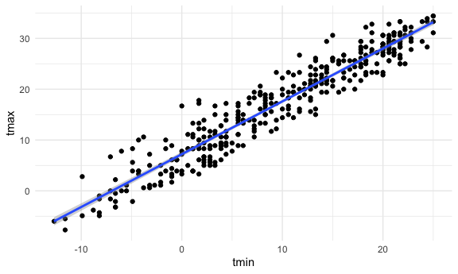

``` r
#appears pretty linear
```

Next, bootstrapping. I will write the bootstrap function first.

``` r
boot_sample = function(df) {
  
  sample_frac(df, replace = TRUE) %>% 

    arrange(tmin)

}
```

Now I check that this works

``` r
boot_sample(weather_df) %>% 
  ggplot(aes(x = tmin, y = tmax)) +
  geom_point(alpha = .3) +
  geom_smooth(method = "lm")
```

    ## `geom_smooth()` using formula 'y ~ x'

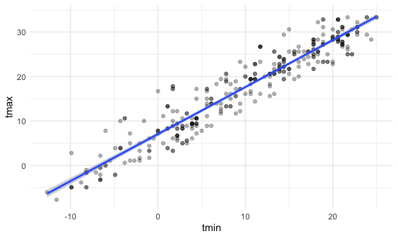

``` r
boot_sample(weather_df) %>% 
  lm(tmax ~ tmin, data = .) %>% 
  broom::tidy()
```

    ## # A tibble: 2 x 5
    ##   term        estimate std.error statistic   p.value
    ##   <chr>          <dbl>     <dbl>     <dbl>     <dbl>
    ## 1 (Intercept)     7.19    0.225       32.0 1.22e-107
    ## 2 tmin            1.03    0.0168      61.8 1.24e-194

Draw many bootstrap samples, first setting 100 samples to save time and
see if my code works. In my final code, I will increase to 5000 samples.

``` r
boot_straps =
  tibble(
    strap_number = 1:100,
    strap_sample = rerun(100, boot_sample(weather_df))
  )

#boot_straps %>% pull(strap_sample)
boot_straps %>% pull(strap_sample) %>% .[[1]]
```

    ## # A tibble: 365 x 6
    ##    name           id          date        prcp  tmax  tmin
    ##    <chr>          <chr>       <date>     <dbl> <dbl> <dbl>
    ##  1 CentralPark_NY USW00094728 2017-12-28     0  -7.7 -11.6
    ##  2 CentralPark_NY USW00094728 2017-12-27     0  -4.3  -8.2
    ##  3 CentralPark_NY USW00094728 2017-03-04     0  -1    -8.2
    ##  4 CentralPark_NY USW00094728 2017-12-27     0  -4.3  -8.2
    ##  5 CentralPark_NY USW00094728 2017-03-04     0  -1    -8.2
    ##  6 CentralPark_NY USW00094728 2017-12-30    13  -4.9  -8.2
    ##  7 CentralPark_NY USW00094728 2017-02-10     0   0    -7.1
    ##  8 CentralPark_NY USW00094728 2017-02-09   295   6.7  -7.1
    ##  9 CentralPark_NY USW00094728 2017-03-12     0  -1.6  -7.1
    ## 10 CentralPark_NY USW00094728 2017-02-09   295   6.7  -7.1
    ## # … with 355 more rows

``` r
boot_straps %>% pull(strap_sample) %>% .[[21]]
```

    ## # A tibble: 365 x 6
    ##    name           id          date        prcp  tmax  tmin
    ##    <chr>          <chr>       <date>     <dbl> <dbl> <dbl>
    ##  1 CentralPark_NY USW00094728 2017-12-31     0  -6   -12.7
    ##  2 CentralPark_NY USW00094728 2017-12-31     0  -6   -12.7
    ##  3 CentralPark_NY USW00094728 2017-01-09     0  -4.9  -9.9
    ##  4 CentralPark_NY USW00094728 2017-01-09     0  -4.9  -9.9
    ##  5 CentralPark_NY USW00094728 2017-01-08     0  -3.8  -8.8
    ##  6 CentralPark_NY USW00094728 2017-12-27     0  -4.3  -8.2
    ##  7 CentralPark_NY USW00094728 2017-12-30    13  -4.9  -8.2
    ##  8 CentralPark_NY USW00094728 2017-02-10     0   0    -7.1
    ##  9 CentralPark_NY USW00094728 2017-02-10     0   0    -7.1
    ## 10 CentralPark_NY USW00094728 2017-03-13     0   2.2  -6.6
    ## # … with 355 more rows

``` r
boot_straps %>% pull(strap_sample) %>% .[[97]]
```

    ## # A tibble: 365 x 6
    ##    name           id          date        prcp  tmax  tmin
    ##    <chr>          <chr>       <date>     <dbl> <dbl> <dbl>
    ##  1 CentralPark_NY USW00094728 2017-12-29     0  -5.5 -11.6
    ##  2 CentralPark_NY USW00094728 2017-03-05     0   2.8  -9.9
    ##  3 CentralPark_NY USW00094728 2017-01-09     0  -4.9  -9.9
    ##  4 CentralPark_NY USW00094728 2017-03-05     0   2.8  -9.9
    ##  5 CentralPark_NY USW00094728 2017-01-09     0  -4.9  -9.9
    ##  6 CentralPark_NY USW00094728 2017-01-08     0  -3.8  -8.8
    ##  7 CentralPark_NY USW00094728 2017-03-11     0  -1.6  -8.2
    ##  8 CentralPark_NY USW00094728 2017-03-11     0  -1.6  -8.2
    ##  9 CentralPark_NY USW00094728 2017-02-09   295   6.7  -7.1
    ## 10 CentralPark_NY USW00094728 2017-03-12     0  -1.6  -7.1
    ## # … with 355 more rows

Generate models for strap\_sample tibbles

``` r
boot_results =
  boot_straps %>% 
  mutate(
    models = map(.x = strap_sample, ~lm(tmax ~ tmin, data = .x)),
    r_squared = map(models, broom::glance),
    results = map(models, broom::tidy)
  ) %>% 
  unnest(r_squared) %>%
  select(strap_number, models, r.squared, results) %>% 
  mutate(
    r_squared = r.squared,
    r_sq_ci_lower = quantile(r.squared, 0.025),
    r_sq_ci_upper = quantile(r.squared, 0.975)
  ) %>% 
  unnest(results) %>% 
  select(strap_number, r_squared, r_sq_ci_lower, r_sq_ci_upper, term, estimate) %>% 
  pivot_wider(
    names_from = term,
    values_from = estimate
  ) %>% 
  mutate(
    log_computation = log(`(Intercept)` * tmin),
    log_comp_ci_lower = quantile(log_computation, 0.025),
    log_comp_ci_upper = quantile(log_computation, 0.975)
  ) %>% 
  select(-`(Intercept)`, -tmin)

boot_results %>% 
  ggplot(aes(x = r_squared)) +
  geom_histogram()
```

    ## `stat_bin()` using `bins = 30`. Pick better value with `binwidth`.

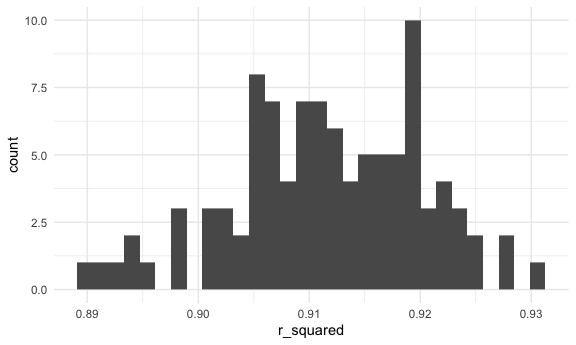

``` r
boot_results %>% 
  ggplot(aes(x = r_squared)) +
  geom_density()
```

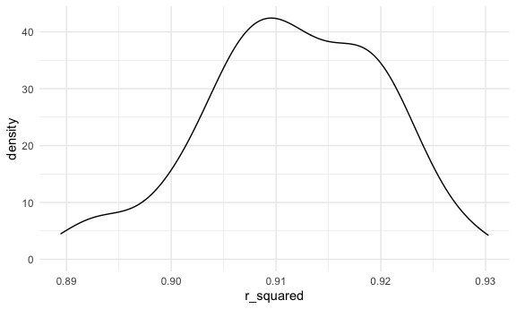

``` r
boot_results %>% 
  ggplot(aes(x = log_computation)) +
  geom_histogram()
```

    ## `stat_bin()` using `bins = 30`. Pick better value with `binwidth`.

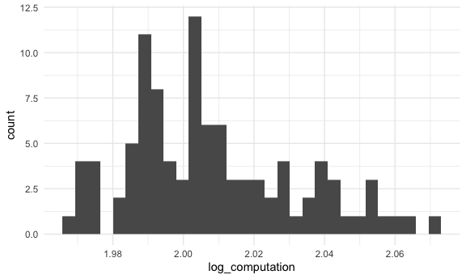

``` r
boot_results %>% 
  ggplot(aes(x = log_computation)) +
  geom_density()
```

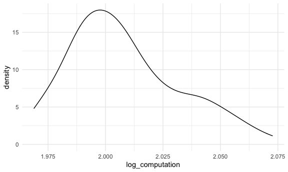

The distribution of r\_squared and log(Bo \* B1) appears normally
distributed for 100 bootstrap samples. I will now repeat the code for
5000 bootstrap samples.

``` r
boot_straps =
  tibble(
    strap_number = 1:5000,
    strap_sample = rerun(5000, boot_sample(weather_df))
  )

boot_results =
  boot_straps %>% 
  mutate(
    models = map(.x = strap_sample, ~lm(tmax ~ tmin, data = .x)),
    r_squared = map(models, broom::glance),
    results = map(models, broom::tidy)
  ) %>% 
  unnest(r_squared) %>%
  select(strap_number, models, r.squared, results) %>% 
  mutate(
    r_squared = r.squared,
    r_sq_ci_lower = quantile(r.squared, 0.025),
    r_sq_ci_upper = quantile(r.squared, 0.975)
  ) %>% 
  unnest(results) %>% 
  select(strap_number, r_squared, r_sq_ci_lower, r_sq_ci_upper, term, estimate) %>% 
  pivot_wider(
    names_from = term,
    values_from = estimate
  ) %>% 
  mutate(
    log_computation = log(`(Intercept)` * tmin),
    log_comp_ci_lower = quantile(log_computation, 0.025),
    log_comp_ci_upper = quantile(log_computation, 0.975)
  ) %>% 
  select(-`(Intercept)`, -tmin)

boot_results %>% 
  ggplot(aes(x = r_squared)) +
  geom_histogram()
```

    ## `stat_bin()` using `bins = 30`. Pick better value with `binwidth`.

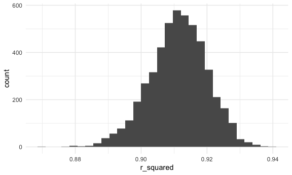

``` r
boot_results %>% 
  ggplot(aes(x = r_squared)) +
  geom_density()
```

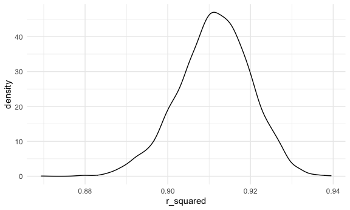

``` r
boot_results %>% 
  ggplot(aes(x = log_computation)) +
  geom_histogram()
```

    ## `stat_bin()` using `bins = 30`. Pick better value with `binwidth`.

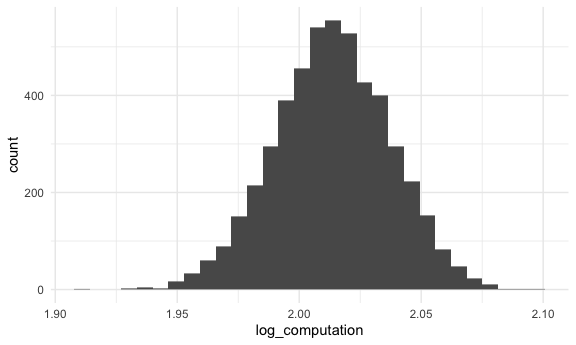

``` r
boot_results %>% 
  ggplot(aes(x = log_computation)) +
  geom_density()
```

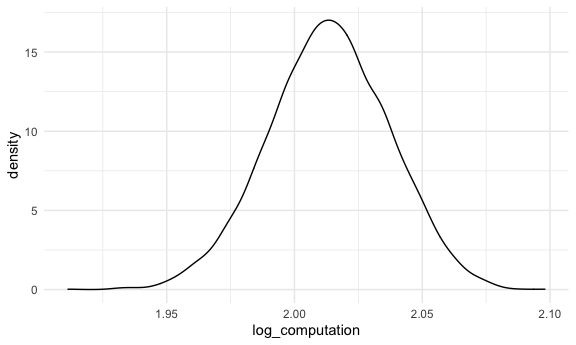

The distribution of r\_squared appears normally distributed, but with a
leftward skew. The distribution of log(B0 \* B1) also appears to be
normally distributed with a slight leftward skew.
